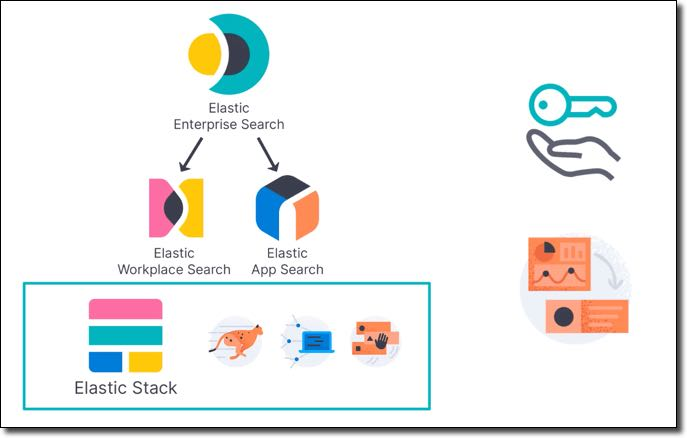
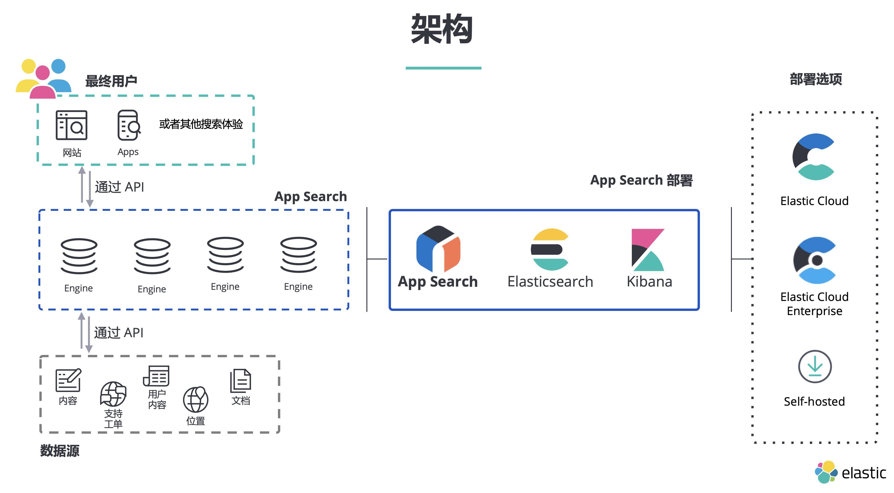
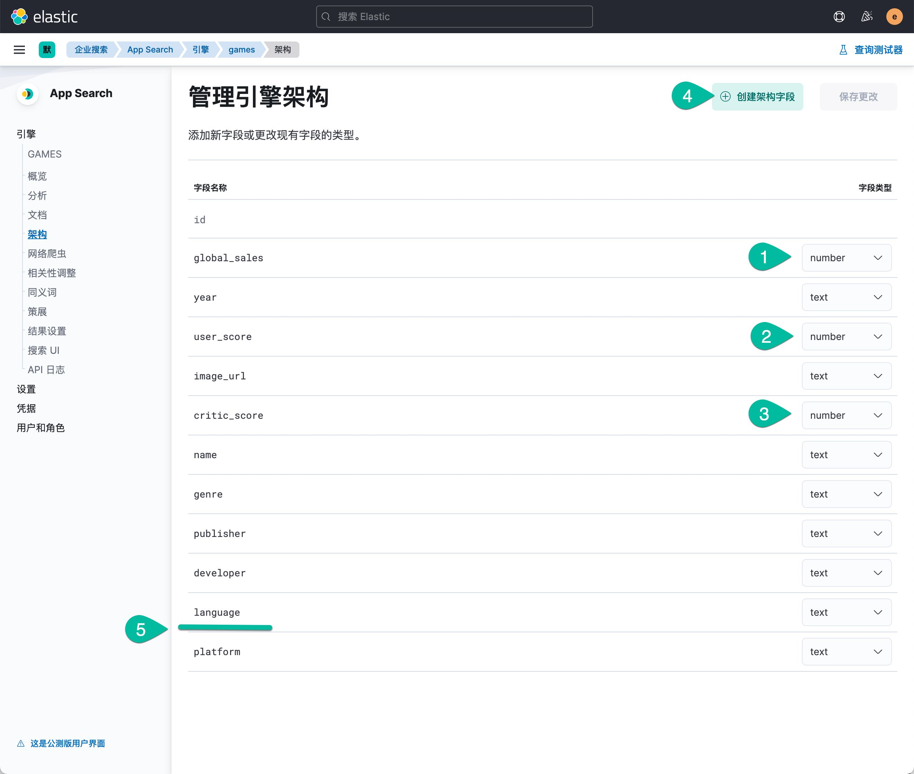
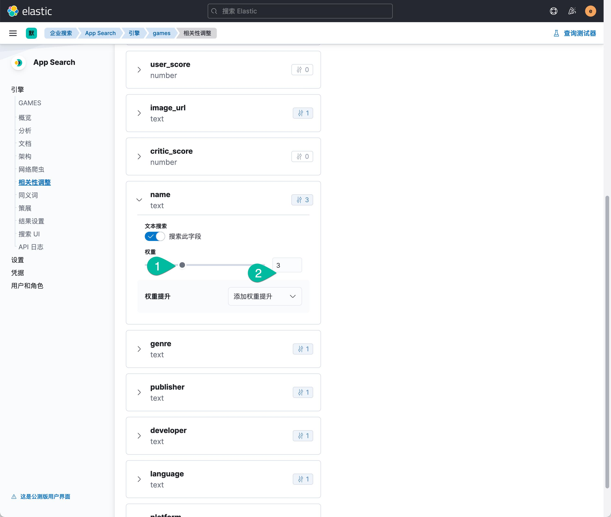
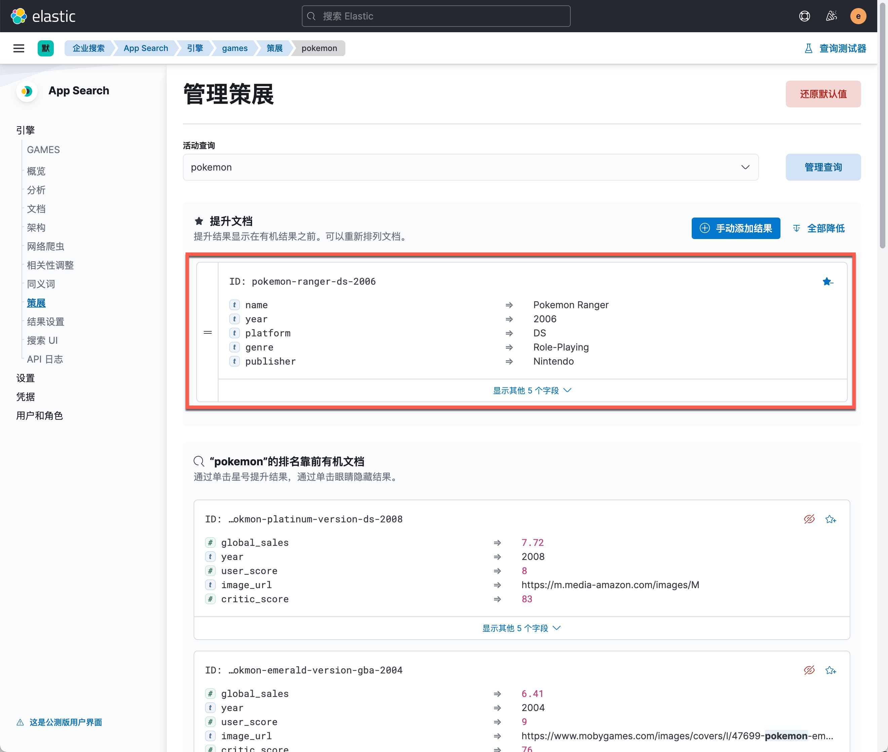
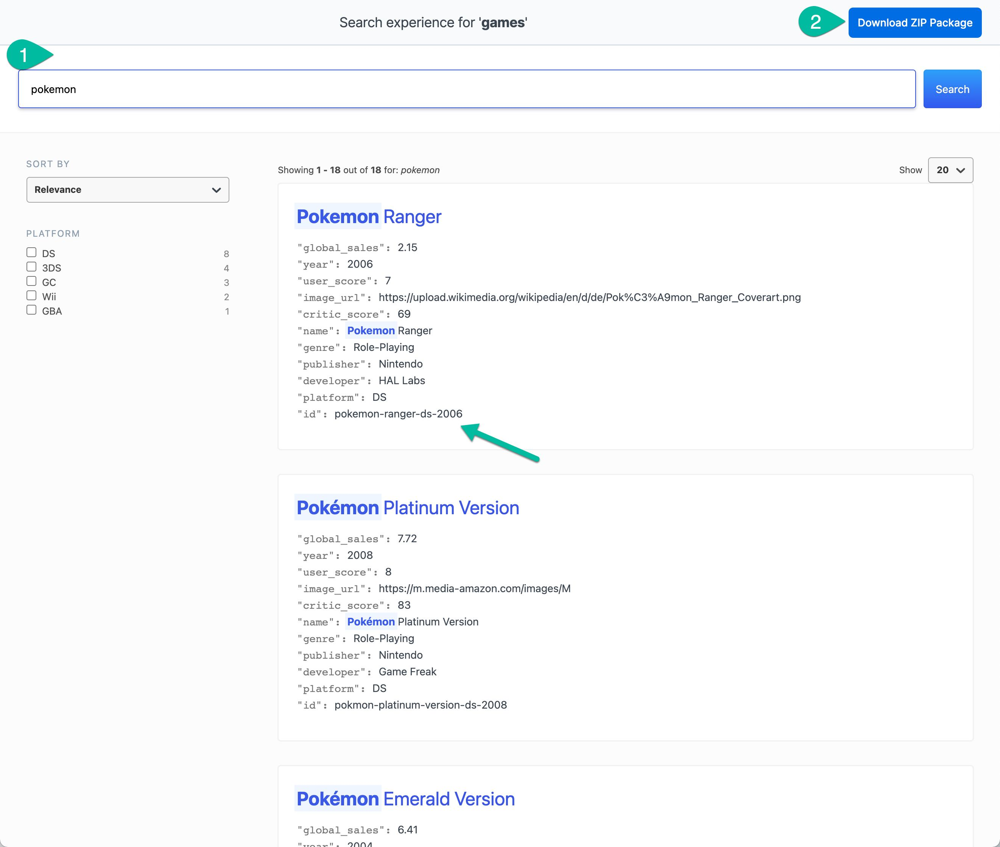

summary: Elastic 企业搜索(中等)
id: entprise-search-foundation
categories: elasticsearch, appsearch, kibana, workplace
tags: elasticstack
status: Published 
authors: Martin Liu
Feedback Link: https://martinliu.cn
Analytics Account: UA-159133967-1


# Elastic 企业搜索工作坊(中等)
<!-- ------------------------ -->

## 概述 
Duration: 5


Elastic 企业搜索解决方案由三个部分组成：

* Workplace Search ：通过整合您的所有内容平台（Google 云端硬盘、Slack、Box、Salesforce 等等），打造个性化的搜索体验，提高团队的工作效率。Elastic Workplace Search 可以灵活轻松地进行部署（既可在 Elastic Cloud 上部署，亦可免费下载进行自管型部署），不仅对相关性预先进行了调优，而且界面直观，能够帮助您和您的队友快速返岗工作。
* 通过精心打造的 Elastic App Search 体验，您能够在精致的 API 集合以及直观的仪表板中感受 Elasticsearch 的强大功能。利用无缝可扩展性，可以调整相关性，提供详尽的文档，拥有经过良好维护的客户端，还具备强大的分析能力，通过这些优点，您能够轻松打造领先的搜索体验。
* Site Search：Elastic Site Search（之前的 Swiftype Site Search）能够为您提供构建强大的网站搜索功能所需的工具，而且您轻轻松松即可学会。免维护爬虫能够确保网站内容保持最新状态，同时直观的定制功能和强大的分析能力可以让您充分掌控相关度。所有这些，都支持大规模扩展，且由 Elasticsearch 提供支持。


### Gartner 洞见引擎魔力象限

Elastic 在 2021 年度《Gartner 洞见引擎魔力象限》中被定位为挑战者。 Elastic 是《Gartner 洞见引擎魔力象限》的新成员。了解为什么我们相信 Elastic 在今年的报告中被定位为挑战者，以及为什么我们是唯一一家为任何网站、应用或工作场所提供免费开源、功能强大、现代风格搜索解决方案的供应商。


### 解决方案架构

这是一款基于 Elastic Stack 的解决方案，它的核心搜索技术是 Elasticsearch；因此，用户可以高速的、可扩展的处理大量数据，并且获得想要的搜索结果。




本课程所使用到的 Elastic Stack 的组件包括：

* Elasticsearch、Kibana 的版本是 7.15. 0
* Elastic Enterprise Search 7.15.0


App Search 系统架构图如下：



上图中的 App Search 服务器目前和 Workspace Search 等功能一起整合到了统一的 Enterprise Search 服务器中，安装了 Enterprise Server 就得到了所有企业搜索解决方案的各种功能。

## 系统准备
Duration: 15


本培训的所有操作和配置都从在一个虚拟机上完成。需要启动一个 CentOS 8 Linux 虚拟机，需求如下：

* 内存建议至 6GB。
* 磁盘10GB 以上。
* 有顺畅的互联网连接，在练习的过程中需要从互联网下载软件包。
* 虚拟机软件不限，VMWare，Virtualbox 或者是云主机都可以。

本课程使用的 Elastic Stack 安装包，示例配置文件都可以在下列位置获取。

Elastic Stack 软件安装包清单：

* elasticsearch-7.15.0-x86_64.rpm
* kibana-7.15.0-x86_64.rpm
* enterprise-search-7.15.0.rpm


安装 Enterprise Search 所需要的 JDK，SSh 等了 CentOS 虚拟机后，运行下面的命令。

```sh
yum install -y java-11-openjdk.x86_64
```


###安装配置 Elasticsearch

使用清华大学的YUM镜像源安装。

```shell
sudo yum install -y https://mirror.tuna.tsinghua.edu.cn/elasticstack/yum/elastic-7.x/7.15.0/elasticsearch-7.15.0-x86_64.rpm
```

在启动 Elasticsearch 服务之前，创建启用安全选项所需的 TLS 数字证书，运行证书创建工具如下所示：

```shell
sudo /usr/share/elasticsearch/bin/elasticsearch-certutil cert -out /etc/elasticsearch/elastic-certificates.p12 -pass ""
sudo chmod 660 /etc/elasticsearch/elastic-certificates.p12
sudo ls -l /etc/elasticsearch/elastic-certificates.p12
```

将 Elasticsearch 默认的配置文件内容更新为如下内容。

```yaml
# ---------------------------------- Cluster -----------------------------------
cluster.name: elk-es01

# ----------------------------------- Paths ------------------------------------
path.data: /var/lib/elasticsearch
path.logs: /var/log/elasticsearch

# ---------------------------------- Network -----------------------------------
network.host: 0.0.0.0

# --------------------------------- Discovery ----------------------------------
discovery.type: single-node

# ------------------------------- TLS and Cert ---------------------------------
xpack.security.enabled: true

xpack.security.transport.ssl.enabled: true
xpack.security.transport.ssl.verification_mode: certificate
xpack.security.transport.ssl.keystore.path: elastic-certificates.p12
xpack.security.transport.ssl.truststore.path: elastic-certificates.p12

# ------------------------------- Security ---------------------------------
xpack.security.authc.api_key.enabled: true
xpack:
  security:
    authc:
      realms:
        native:
          native1:
            order: 0

#  ------------------------------- App Search ---------------------------------
action.auto_create_index: ".app-search-*-logs-*,-.app-search-*,+*"
```

用以上配置内容，创建名为 'sec.yml' 的配置文件，替换默认 'elasticsearch.yml' 配置文件的内容（下面用 cp 命令覆盖默认配置文件的方式更新默认配置文件，后续的所有配置更新都会使用这个方式）。然后启动 Elasticsearch 服务。

```sh
sudo cp sec.yml /etc/elasticsearch/elasticsearch.yml
sudo systemctl daemon-reload
sudo systemctl enable elasticsearch.service
sudo systemctl start elasticsearch.service
sudo systemctl status elasticsearch
```

使用 `sudo tail -f /var/log/elasticsearch/elk-es01.log ` 命令查看当前 Elasticsearch 服务的日志。

初始化 ES 服务器内建用户的密码。

```shell
sudo /usr/share/elasticsearch/bin/elasticsearch-setup-passwords interactive -b
```

将本练习所使用的默认密码  `security123` 复制到剪切板，这条命令的每一个提示符出现的位置，用快捷键粘贴输入这个密码之后，按回车输入该密码，用这个方式给所有系统内置账号设置了相同的密码（纯粹测试目的，并不建议这么做）。以上命令的输出如下：

```shell
Enter password for [elastic]:
Reenter password for [elastic]:
Enter password for [apm_system]:
Reenter password for [apm_system]:
Enter password for [kibana_system]:
Reenter password for [kibana_system]:
Enter password for [logstash_system]:
Reenter password for [logstash_system]:
Enter password for [beats_system]:
Reenter password for [beats_system]:
Enter password for [remote_monitoring_user]:
Reenter password for [remote_monitoring_user]:
Changed password for user [apm_system]
Changed password for user [kibana_system]
Changed password for user [kibana]
Changed password for user [logstash_system]
Changed password for user [beats_system]
Changed password for user [remote_monitoring_user]
Changed password for user [elastic]
```

在浏览器中访问 http://IP-address:9200/ ，测试 Elasticsearch 服务是否正常，确认上面配置的 elastic 用户的密码 `security123` 登录。

Negative
: 注意：请确保将 Elasticsearch 服务运行正常，可以在网页浏览器中登录/验证 elastic 用户的密码 security123。

### 安装配置 Kibana

执行 Kibana 安装命令，如下所示：

```shell
sudo yum install -y https://mirror.tuna.tsinghua.edu.cn/elasticstack/yum/elastic-7.x/7.15.0/kibana-7.15.0-x86_64.rpm
```

准备预配置的 Kibana 的配置文件，如下：

```yaml
server.host: "0.0.0.0"
elasticsearch.hosts: ["http://localhost:9200"]
elasticsearch.username: "kibana_system"
elasticsearch.password: security123
enterpriseSearch.host: 'http://localhost:3002'
i18n.locale: zh-CN
xpack.security.enabled: true
xpack.security.encryptionKey: "fhjskloppd678ehkdfdlliverpoolfcr"
xpack.encryptedSavedObjects.encryptionKey: "Si0gjCjujZ0LghDiApKJfGhGeVJ8JwxrY1z7rOpBva"
```

上见示例配置文件 kb.yml。如果你使用的其它自定义的 IP 地址，请注意在后续的所有操作中替换它。

更新默认配置文件，用以上示例配置文件覆盖 Kibana 默认配置文件，然后启动 Kibana 服务。

```shell
sudo cp /etc/kibana/kibana.yml /etc/kibana/kibana.yml.bk
sudo cp kb.yml /etc/kibana/kibana.yml
sudo systemctl start  kibana.service
sudo systemctl status   kibana.service
```

查看 Kibana 服务的日志是否正常。

```shell
sudo tail -f /var/log/messages
```

在浏览器里测试登录 Kibana 的地址  http://192.168.50.11:5601 ，使用 elastic 用户名和密码 security123。点击主页上的“安全”的链接，你应该看到如下的界面。


###启用企业版许可 30 天试用

点击 Kibana 左上角菜单中点击 “Stack Management” --> “许可管理”，点击 “开始试用” 按钮，启用 30 天的高级功能的试用期。


Negative
: 注意：至此完成了 Elastic Stack 的基础准备工作，Elasticsearch + Kibana 的服务都处于正常运行状态，启用了企业版功能的试用。


## 安装 Enterprise Search 服务器
Duration: 25


登陆 CentOS 虚拟机，用 Yum 命令安装。

```sh
sudo yum install -y https://mirror.tuna.tsinghua.edu.cn/elasticstack/yum/elastic-7.x/7.15.0/enterprise-search-7.15.0.rpm
```

创建名为 `ent.yml` 的配置文件，内容如下：

```yaml
ent_search.auth.native1.source: elasticsearch-native
elasticsearch.host: http://127.0.0.1:9200
elasticsearch.username: elastic
elasticsearch.password: security123
allow_es_settings_modification: true
secret_management.encryption_keys: [32ef4fa7890c3cea28f482d364e19ec141d4d09cd4f9de138640b611aa2371c6]
kibana.external_url: http://42.193.98.148:5601
ent_search.external_url: http://42.193.98.148:3002
ent_search.listen_host: 0.0.0.0
ent_search.listen_port: 3002
log_directory: /var/log/enterprise-search
```

用以配置文件替换默认的配置文件。

```sh
sudo cp /usr/share/enterprise-search/config/enterprise-search.yml  /usr/share/enterprise-search/config/enterprise-search.yml.bk
sudo cp ent.yml /usr/share/enterprise-search/config/enterprise-search.yml
```

用下面的命令启动 Enterprise Search 服务：

```sh
ENT_SEARCH_DEFAULT_PASSWORD=search4you /usr/share/enterprise-search/bin/enterprise-search
```

首次启动服务器会自动生成一个密钥，并停止服务启动过程，如下所示：


```sh
[root@VM-0-36-centos ~]# ENT_SEARCH_DEFAULT_PASSWORD=search4you /usr/share/enterprise-search/bin/enterprise-search
Found java executable in PATH
Java version detected: 11.0.12 (major version: 11)
Enterprise Search is starting...
[2021-09-24T07:47:33.530+00:00][18504][2002][app-server][INFO]: Enterprise Search version=7.15.0, JRuby version=9.2.13.0, Ruby version=2.5.7, Rails version=5.1.7
[2021-09-24T07:47:35.207+00:00][18504][2002][app-server][ERROR]: 
--------------------------------------------------------------------------------

Invalid config file (/usr/share/enterprise-search/config/enterprise-search.yml):
The setting '#/secret_management/encryption_keys' is not valid
No secret management encryption keys were provided.
Your secrets cannot be stored unencrypted.
You can use the following generated encryption key in your config file to store new encrypted secrets:

secret_management.encryption_keys: [9a042d154d52508215c534edd5bfde7ddb8647ee79ad104bfa98b2639d23d83c]


--------------------------------------------------------------------------------
```

 复制以上内容中的 secret_management.encryption_keys 这一行，再次修改 Enterprise Search 的配置文件，将新的加密key 更新进去。然后在再次从控制台启动企业搜索服务器，正常的启动日志如下所示：

```sh
[root@VM-0-36-centos ~]# ENT_SEARCH_DEFAULT_PASSWORD=search4you /usr/share/enterprise-search/bin/enterprise-search
Found java executable in PATH
Java version detected: 11.0.12 (major version: 11)
Enterprise Search is starting...
[2021-09-24T07:49:35.872+00:00][18903][2002][app-server][INFO]: Enterprise Search version=7.15.0, JRuby version=9.2.13.0, Ruby version=2.5.7, Rails version=5.1.7
[2021-09-24T07:49:37.452+00:00][18903][2002][app-server][INFO]: Performing pre-flight checks for Elasticsearch running on http://127.0.0.1:9200...
[2021-09-24T07:49:37.898+00:00][18903][2002][app-server][INFO]: [pre-flight] Elasticsearch cluster is ready
[2021-09-24T07:49:37.899+00:00][18903][2002][app-server][INFO]: [pre-flight] Successfully connected to Elasticsearch
[2021-09-24T07:49:37.951+00:00][18903][2002][app-server][INFO]: [pre-flight] Successfully loaded Elasticsearch plugin information for all nodes
[2021-09-24T07:49:37.989+00:00][18903][2002][app-server][INFO]: [pre-flight] Elasticsearch running with an active trial license
[2021-09-24T07:49:38.093+00:00][18903][2002][app-server][INFO]: [pre-flight] Elasticsearch API key service is enabled
[2021-09-24T07:49:38.094+00:00][18903][2002][app-server][INFO]: [pre-flight] ILM is enabled in Elasticsearch
[2021-09-24T07:49:38.095+00:00][18903][2002][app-server][INFO]: [pre-flight] Elasticsearch X-Pack security is enabled and will be used for authentication
[2021-09-24T07:49:38.098+00:00][18903][2002][app-server][INFO]: Elasticsearch looks healthy and configured correctly to run Enterprise Search
[2021-09-24T07:49:38.100+00:00][18903][2002][app-server][INFO]: Performing pre-flight checks for Kibana running on http://42.193.98.148:5601...
[2021-09-24T07:49:39.137+00:00][18903][2002][app-server][INFO]: [pre-flight] Successfully connected to Kibana
[2021-09-24T07:49:40.194+00:00][18903][2002][app-server][INFO]: Kibana looks healthy and configured correctly to run Enterprise Search
Creating Filebeat log directory: /usr/share/enterprise-search/log
[2021-09-24T07:49:52.056+00:00][18903][2002][app-server][INFO]: [db_lock] [installation] Status: [Starting] Ensuring migrations tracking index exists
[2021-09-24T07:49:52.321+00:00][18903][2002][app-server][INFO]: [db_lock] [installation] Status: [Finished] Ensuring migrations tracking index exists
[2021-09-24T07:49:52.423+00:00][18903][2002][app-server][INFO]: [db_lock] [installation] Status: [Starting] Creating indices for 36 models
[2021-09-24T07:49:52.465+00:00][18903][2002][app-server][INFO]: Creating index for Actastic::Schema: connectors_jobs_v5
[2021-09-24T07:49:52.644+00:00][18903][2002][app-server][INFO]: Creating index for Actastic::Schema: synonyms
[2021-09-24T07:49:52.889+00:00][18903][2002][app-server][INFO]: Creating index for Actastic::Schema: document_types_v2
[2021-09-24T07:49:53.249+00:00][18903][2002][app-server][INFO]: Creating index for Actastic::Schema: oauth_access_grants
[2021-09-24T07:49:53.633+00:00][18903][2002][app-server][INFO]: Creating index for Actastic::Schema: oauth_access_tokens
[2021-09-24T07:49:54.150+00:00][18903][2002][app-server][INFO]: Creating index for Actastic::Schema: oauth_applications_v2
[2021-09-24T07:49:54.452+00:00][18903][2002][app-server][INFO]: Creating index for Actastic::Schema: engines_v15
[2021-09-24T07:49:54.910+00:00][18903][2002][app-server][INFO]: Creating index for Actastic::Schema: workplace_search_accounts_v16
[2021-09-24T07:49:55.251+00:00][18903][2002][app-server][INFO]: Creating index for Actastic::Schema: workplace_search_content_sources_v21
[2021-09-24T07:49:55.417+00:00][18903][2002][app-server][INFO]: Creating index for Actastic::Schema: workplace_search_content_source_user_identities_v3
[2021-09-24T07:49:55.592+00:00][18903][2002][app-server][INFO]: Creating index for Actastic::Schema: workplace_search_search_groups_v4
[2021-09-24T07:49:55.925+00:00][18903][2002][app-server][INFO]: Creating index for Actastic::Schema: workplace_search_invitations_v2
[2021-09-24T07:49:56.355+00:00][18903][2002][app-server][INFO]: Creating index for Actastic::Schema: workplace_search_organizations_v16
[2021-09-24T07:49:56.669+00:00][18903][2002][app-server][INFO]: Creating index for Actastic::Schema: workplace_search_pre_content_sources
[2021-09-24T07:49:57.049+00:00][18903][2002][app-server][INFO]: Creating index for Actastic::Schema: workplace_search_role_mappings_v5
[2021-09-24T07:49:57.232+00:00][18903][2002][app-server][INFO]: Creating index for Actastic::Schema: app_search_accounts_v9
[2021-09-24T07:49:57.529+00:00][18903][2002][app-server][INFO]: Creating index for Actastic::Schema: app_search_api_tokens_v3
[2021-09-24T07:49:57.837+00:00][18903][2002][app-server][INFO]: Creating index for Actastic::Schema: app_search_api_token_engines
[2021-09-24T07:49:57.992+00:00][18903][2002][app-server][INFO]: Creating index for Actastic::Schema: app_search_crawler_content_metadata
[2021-09-24T07:49:58.271+00:00][18903][2002][app-server][INFO]: Creating index for Actastic::Schema: app_search_crawler_content_url_metadata
[2021-09-24T07:49:58.426+00:00][18903][2002][app-server][INFO]: Creating index for Actastic::Schema: app_search_document_positions
[2021-09-24T07:49:58.608+00:00][18903][2002][app-server][INFO]: Creating index for Actastic::Schema: app_search_document_position_queries_v3
[2021-09-24T07:49:58.804+00:00][18903][2002][app-server][INFO]: Creating index for Actastic::Schema: app_search_invitations_v3
[2021-09-24T07:49:58.982+00:00][18903][2002][app-server][INFO]: Creating index for Actastic::Schema: app_search_roles_v3
[2021-09-24T07:49:59.166+00:00][18903][2002][app-server][INFO]: Creating index for Actastic::Schema: app_search_role_engines_v3
[2021-09-24T07:49:59.336+00:00][18903][2002][app-server][INFO]: Creating index for Actastic::Schema: app_search_search_settings
[2021-09-24T07:49:59.499+00:00][18903][2002][app-server][INFO]: Creating index for Actastic::Schema: app_search_role_mappings_v4
[2021-09-24T07:49:59.693+00:00][18903][2002][app-server][INFO]: Creating index for Actastic::Schema: app_search_role_mapping_engines_v3
[2021-09-24T07:50:00.073+00:00][18903][2002][app-server][INFO]: Creating index for Actastic::Schema: reindex_jobs
[2021-09-24T07:50:00.226+00:00][18903][2002][app-server][INFO]: Creating index for Actastic::Schema: secret_keeper_secrets
[2021-09-24T07:50:00.415+00:00][18903][2002][app-server][INFO]: Creating index for Actastic::Schema: crawler_domains_v4
[2021-09-24T07:50:00.738+00:00][18903][2002][app-server][INFO]: Creating index for Actastic::Schema: crawler_crawl_requests_v4
[2021-09-24T07:50:00.918+00:00][18903][2002][app-server][INFO]: Creating index for Actastic::Schema: crawler_process_crawls
[2021-09-24T07:50:01.075+00:00][18903][2002][app-server][INFO]: Creating index for Actastic::Schema: crawler_robots_txts_v3
[2021-09-24T07:50:01.558+00:00][18903][2002][app-server][INFO]: Creating index for Actastic::Schema: telemetry_status_v2
[2021-09-24T07:50:01.751+00:00][18903][2002][app-server][INFO]: Creating index for Actastic::Schema: users_v6
[2021-09-24T07:50:03.029+00:00][18903][2002][app-server][INFO]: Saving 95 Actastic migrations
```

以上为正常的启动日志，下面登陆 Kibana 确认 企业搜索功能可以正常使用。


点击 ‘企业搜索’


点击 ‘打开App search’ 按钮。


到目前为止，我们完成了如下工作：

* Elasticsearch 服务器的安装配置
* Kibana 服务器测安装配置
* Enterprise Search服务器的安装配置，实现了使用 Elasticsearch的内置用户认证登陆 Enterprise Serach服务器的应用。


Negative
: 注意：完成了在单机上所有基础环境的配置和搭建，完成了基础的配置准备工作。


## App Search 实战
Duration: 35

它的特点是帮助开发者随心所欲的为已有的或者正在开发的项目增加功能强大的搜索功能，而且将搜索功能的实施成本降低到无痛点的程度。App Search 可以覆盖的使用场景如下：

- SaaS / web 应用
- 复杂的电商应用
- 客户支持服务站点
- Geo 地理搜索
- 公司官网
- 内部的搜索
- 还有更多其他


### 创建名为 GAMES 的搜索引擎

在首页的创建引擎的输入框中输入 games， 语言选择默认选项，点击创建。浏览新创建的引擎，点击左下角的菜单 Credentials，复制 privite-key 备用。


* 输入引擎名称： games
* 点击 “创建引擎” 按钮

下面通过网页上传 JSON 文件的方式，给这个搜索引擎中初始化数据。

JASON文件的下载地址：


1. 点击 上传 JSON 文件按钮
2. 将下载好的文件拖拽到这个位置
3. 点击 ‘继续’ 按钮


从以上的界面中可以看到已经成功的上传了 4057 条游戏数据。索引了这下初始化数据之后，在搜引擎的左侧菜单中，点击进入‘文档’页面，浏览索引后的数据，用右上角的“测试茶香气”进行一些搜索，了解这些数据的内容，注意观察当前搜索的结果和排序。

### 修改数据结构Schema

开发者可以按照需要随时修改 Schema，实际上这是一个 Schemaless 的平台。 Schema 的修改后，数据即可生效，在这个过程中前端用户的搜索体验不会受到任何影响。



工作流程：

1. 修改 global_sales 的字段类型为 number
2. 修改 user_score 的字段类型为 number
3. 修改 critic_score 的字段类型为 number
4. 点击 ‘创建架构字段’ 按钮，增加一个名为 language 的 text 类型的字段。


### 按需调教搜索引擎

#### 创建同义词

为 Pokemon 创建同义词 Pikachu，如下图所示。


操作流程：

1. 点击左侧菜单的 ‘ 同义词’ 链接，点击 ‘创建同义词集’ 按钮
2. 输入 pokemon
3. 输入 pikachu
4. 点击 ‘ 保存’ 按钮
5. 在搜索测试起中尝试着两个词的搜索结果

#### 调整搜索字段的权重

做如下两个调整：


1. 在预览查询的搜索框中输入 pokemon 
2. 为 globa_sales 增加 Functional Boost 1。
3. 为 Name 增加 weight 3。
4. 在这个调整过程中，观察右侧的搜结果的动态变化，还可以做其他字段的修改，直到搜素结果满意为止。


操作流程：

1. 点击左侧 ‘相关性调整’
2. 点击该字段右上角的数字0的按钮， 在菜单中选择 ‘ 函数’




操作流程：

1. 点击 name 字段，用鼠标指针拖动滑杆的原点
2. 直到权重数量变为 3
3. 在这个过程中，观察右侧搜索结果清单中每一个数据右上角的 score 数据的变化。
4. 最后点击右上角的 ‘ 保存’ 按钮


#### 创建 ‘策展‘

故意将某条搜索结果置顶，这有可能因为，这款游戏目前是热评游戏，是畅销爆款，是高利率商品，是广告商品，或者其他业务原因。可以给某个关键字的搜索结果中，置顶一条或者多条搜索结果。下面将 pokemon 的 pokemon-ranger-ds-2006 这款产品置顶。点击右上角的测试查看器测试一下置顶前后的差异。


1. 点击左侧菜单 ‘策展’
2. 点击 ‘创建策展’ 按钮


1. 输入目标关键字 pokemon
2. 点击 ‘继续’ 按钮


1. 在结果中找到目标置顶的记录 ‘ pokemon-ranger-ds-2006' 
2. 点击右上角的星号按钮



1. 返回搜索结果清单
2. 点击右上角的 ‘ 查询测试器’，搜索 pokemon ，观察结果清单，确认首条搜索结果是什么。


Negative
: 注意： 这里我们完成了首个搜索引擎的数据初始化、字段类型调整、同义词字典、搜索字段权重和置顶策略展示的设置，基本上搜索功能可以达到我们的需求。

### 提供用户搜索界面

搜索引擎提供了用户搜索节目的设计功能，下面我们实现一个最简洁实用的用户搜索界面。


操作说明：

1. 点击左侧菜单的 ‘ 搜索 UI’
2. 输入如图：2到5的相关字段
3. 点击 ‘生成搜索体验’ 按钮
4. 在新窗口中观察和体验搜索UI的功能。



搜索界面说明：

1. 这就是用户将会使用到的搜索界面
2. 输入搜索关键字 pokemon
3. 确认首条搜索结果的ID 
4. 点击右上角的下载按钮，获得这个界面的源码


下载到的这个 zip 文件是一个半成品，简单的使用说明如下：

1. 解压后，进入解压后的目录。
2. 在该目录中，执行 node.js 应用的 npm install 命令，在本地搭建运行环境
3. 运行环境就绪后，在本地运行这个界面，本地测试确认这个UI 的功能
4. 最后运行 npm run build 命令，构建出可以发布给用户使用的版本，在build 目录中查看，构建结果
5. build 目录中的文件部署到一个web 服务器上，测试最终的使用效果。


## 总结
Duration: 15


使用 App Search 搜索平台，开发者可以快速的开发出一套定制化的搜索系统，轻松的实现后台搜索业务逻辑的调整，并轻松的将用户搜索界面测试后部署上线。


推荐阅读文档：

* https://www.elastic.co/downloads/enterprise-search#ga-release
* https://www.elastic.co/guide/en/enterprise-search/7.14/index.html
* https://www.elastic.co/guide/en/app-search/current/index.html


推荐扩展实操练习：

1. 创建一个网页爬虫的搜索引擎，抓取自己的blog，或者抓取公司内部网站，测试和发布这个搜索UI
2. 创建 Workspace Search ，在 Workspace 中增加 GitHab 和 Jira 作为搜索源，[参考文档](https://martinliu.cn/blog/getting-start-elastic-workplace-search/)


