summary: Elastic Stack 可观测性实战工作坊(腾讯)
id: elastic-observability-foundation-qq
categories: elasticsearch, beats, kibana, observability
tags: elasticstack
status: Published 
authors: Martin Liu
Feedback Link: https://martinliu.cn
Analytics Account: UA-159133967-1


# Elastic Stack 可观测性实战工作坊(腾讯)
<!-- ------------------------ -->
## 课程概述 
Duration: 10

在本课程中您将会学到：

1. 在腾讯云创建 Elasticsearch 集群，Kibana 图形管理界面的基本使用。
2. 学习可观测性的基本概念和实施步骤
3. 搭建和配置服务健康检查的探针（Heartbeat）
4. 部署采集操作系统性能监控指标的流程 （Metricbeat）
5. 配置操作系统日志的采集和分析工具（Filebeat）
6. 搭建用于 APM 追踪分析的后台服务（Elastic APM）
7. 运行一个多层架构的宠物诊所应用，对各个子服务进行 APM 监控埋点
8. 配置常用的服务质量监控大屏（SRE/SLO）

本课程基于腾讯云环境。详细的环境准备和前置需求见下一节。

### 示例应用


本工作坊课程基于如下的应用系统。

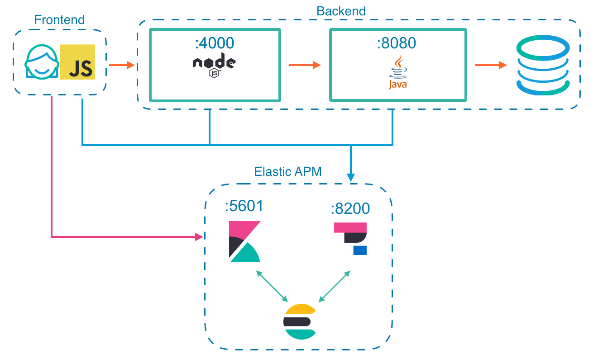

示例应用概况：

* 多层宠物诊所应用系统
* 所有组件都部署在一个虚拟机上
* 包括前端、后端和内置的数据库
* 使用到的而技术有 JavaScript、NodeJs 和 Java Spring 等。
* 使用 Nginx 做前端的接入层
* 本应用系统是被监控的对象

Elastic Stack 的基本状况：

* 版本 7.10.1
* Elastic Stack 的相关组件包括 Elasticsearch、Kibana、APM、Filebeat、Metricbeat 和 Heartbeat。
* 宠物诊所应用、Elastic APM Server 和 Heartbeat 探针服务都部署在同一个虚拟机上。

### 可观测性构建四步法

可观测性依赖于应用系统自身和监控工具平台的配合实现。

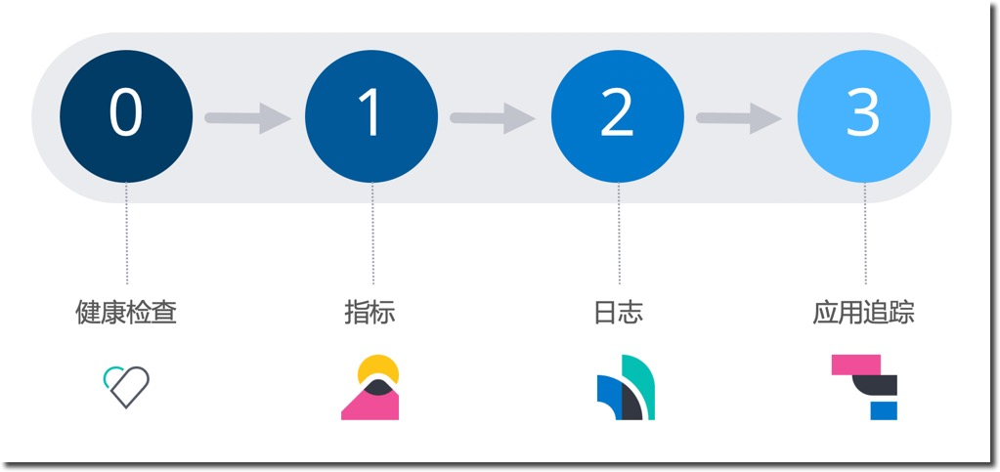

分层次的构建可观测性的推荐过程如下：

1. STEP0：使用 Heartbeat 构建轻量灵活的服务健康检查能力
2. STEP1：使用 Metricbeat 构建全面细致的指标采集能力
3. STEP2：使用 Filebeat 构建高维度的日志采集能力
4. STEP3：使用 APM 构建分布式应用系统的全堆栈追踪能力

### 实施服务质量监控

通过以上的四个构建步骤，使用 Elastic Stack 实施服务可观测性的四大监控能力的构建，搭建持续统一的运维管理工具平台。

使用 SRE 基于‘用户旅程’或‘系统边界’的 SLO 分析设定方法，从 Elastic Stack 的已有数据采集能力中，选取第一批直接可用的 SLI 采集点。在基于 SLO 的监控过程中，不断的优选 SLI，调整告警的数量和质量，为开发团队提供持续有效的服务稳定性反馈。

最后，通过 SLO 服务质量目标监控大屏，实时的将生产环境的状态反馈给所有相关团队。最后收尾以基于 SLO 的服务故障监控告警（本课程不涉及告警的配置，告警可以用 Elastic Stack 的 watcher 实现）。

## 前置需求 
Duration: 10

检查清单如下：

* 创建一台 CentOS 虚拟机（本教程中使用 CentOS 7.6）。
* 虚拟机的网络和 Elasticsearch 服务的网段可以互通，并且所有端口都可以互通。
* 可以通过浏览器正常登录使用 Kibana 服务。
* 可以用 SSH 客户的正常访问以上 CentOS 虚拟机。

CentOS 虚拟机开放如下入栈端口：

* TCP 8200  0.0.0.0/0
* TCP 4000  0.0.0.0/0
* TCP 80    0.0.0.0/0
* TCP 22    0.0.0.0/0

创建虚拟机用于本次培训的所有测试，也可以使用已有虚拟机，和已经创建的 Elasticsearch 服务完成本培训的所有练习。

### 创建一个 Elasticsearch 集群

登录腾讯云控制台，搜索 Elasticsearch Service 产品，进入该产品控制台，点击 “新建” 集群按钮。

    在选择 Elasticsearch 版本的时候请选择最新的版本，本教程尽量和最新的版本保护一致，也适用于相近的旧版本。


注意：以上配置选项适用于本次培训的需求，其中数据节点数量还可以降低到 2个。Elasticsearch 的版本选择最高，高级特性选择“白金版”

在点击 “下一步” 按钮之后，输入集群名、密码等信息，然后完成集群的创建。

### 记录集群的基础信息

在集群成功创建之后，点击 Kibana 访问该集群的对应的 Kibana 图形控制界面，验证 elastic 用户的密码是否可用。

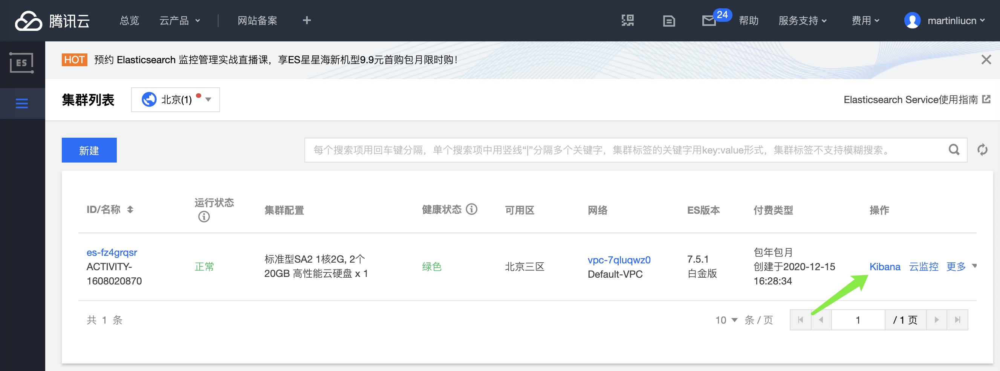

点击集群的名称，查看访问控制部分，记录这个集群的内网访问地址，例如：`172.21.16.16:9200` 备用。

点击集群管理的 ‘可视化配置’ 标签， 点击启用 Kibana 的内网访问地址，并记录这个网址备用。例如： `http://es-fz4grqsr.internal.kibana.tencentelasticsearch.com:5601`


注意：以上备注的 Elasticsearch 集群的内网访问地址，和 Kibana 的内网访问地址会在下面的配置操作中使用到。

最后，需要在 Kibana 的开发者工具里调整一个集群参数。


```
PUT _all/_settings
  {
    "refresh_interval": "1s"
  }
```

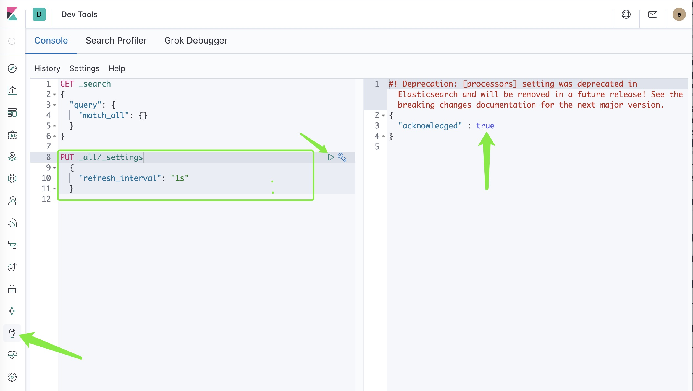


点击左侧的开发者工具图标，在 `Console` 的代码输入区域中输入以上代码片段，将光标移动到 `PUT` 这一行，点击哪一行右侧的三角形播放按钮，等待右侧出现 `true` 的执行结果即可。

### 虚拟机环境基础配置

安装必要的软件包，命令如下：

```
yum install -y java-11-openjdk.x86_64 nodejs git nginx
```

然后下载本次培训所需要的示例程序和相关配置文件。

```
git clone https://gitee.com/devopscoach/elastic-labs-qq.git
cd elastic-labs-qq
cd petclinic/frontend/
npm install
```

在以上命令中， `git clone` 和 `npm install` 可能需要花费 5 到 10 分钟不等。请确保以上几条命令都正常执行完毕。

Negative
: 检查点：已经正常登陆了 Kibana 图形界面。已经 SSH 登陆了CentOS 虚拟机。在虚拟机中可以 ping 通 Elasticsearch 集群中的任意节点。


## STEP0：服务健康检查 
Duration: 20

Positive
: 我们的各种业务服务当前的状态是死是活？这应该是首要回答的问题。

在这一节中，你将学习到：

1. 安装 Heartbeat 探针服务
2. 配置主配置文件
3. 初始化和运行 Heartbeat 服务
4. 在 Kibana 中查看 Uptime app 中的数据


### 运行 Heartbeat 服务

SSH 登录 CentOS 虚拟机后，安装 Heartbeat 软件包。


```
yum install -y https://mirrors.cloud.tencent.com/elasticstack/7.x/yum/7.10.1/heartbeat-7.10.1-x86_64.rpm
```

进入 heartbeat 的配置文件目录中，`cd /etc/heartbeat/`。

### 编辑主配置文件

修改名为 heartbeat.yml 的配置文件，确保其中的内容至少包括：

```
heartbeat.config.monitors:
  path: ${path.config}/monitors.d/*.yml
  reload.enabled: true
  reload.period: 5s
heartbeat.monitors:
- type: http
  id: my-monitor
  name: my-kibana-service
  urls: ["https://es-fz4grqsr.kibana.tencentelasticsearch.com:5601/"]
  schedule: '@every 5s'
setup.template.settings:
  index.number_of_shards: 1
  index.codec: best_compression
setup.kibana:
output.elasticsearch:
  hosts: ["172.21.16.16:9200"]
  username: "elastic"
  password: "Elastic@1234#"
processors:
  - add_observer_metadata:
      geo:
        name: China-BJ
        location: "39.907568, 116.3972302"
```

也可以用以上内容替换原始配置文件中的内容。以上配置文件的范例，见 git clone 下载的目录。

参数配置简要介绍：
* 每 5 秒钟检查 `monitors.d` 目录中是否有服务探针配置文件更新
* 默认启动一个名为 my-monitor 的 http 探针，检查目标 Kibana 服务的状态
* 将服务健康检查的数据输出索引到以上创建的 Elasticsearch 集群服务，即 172.21.16.16:9200
* 在 output.elasticsearch 的部分使用 elastic 账号的密码
* 为本健康检查服务器配置可观测性地域元数据，名称为 China-BJ 的经纬度


### 初始化和运行 Heartbeat 服务

运行下面的命令初始化 Heartbeat 服务，并在命令行中验证 Heartbeat 访问是否能正常工作。

命令如下：

```shell
heartbeat test confg
heartbeat test output

heartbeat setup
heartbeat -e
```

命令参数解释：

* test 命令是检查配置文件的语法和与 Elasticsearch 服务的连接和认证是否正常
* setup 的作用是初始化 Heartbeat 的索引，导入相关的数据管理策略
* -e 启动 Heartbeat 服务，将服务运行的日志显示在控制台

如果以上命令都没有报错，则继续下面的操作。


### 查看 Uptime 应用

进入 Kibana 页面，点击左上角的菜单，在左侧菜单中点击 Uptime 链接。

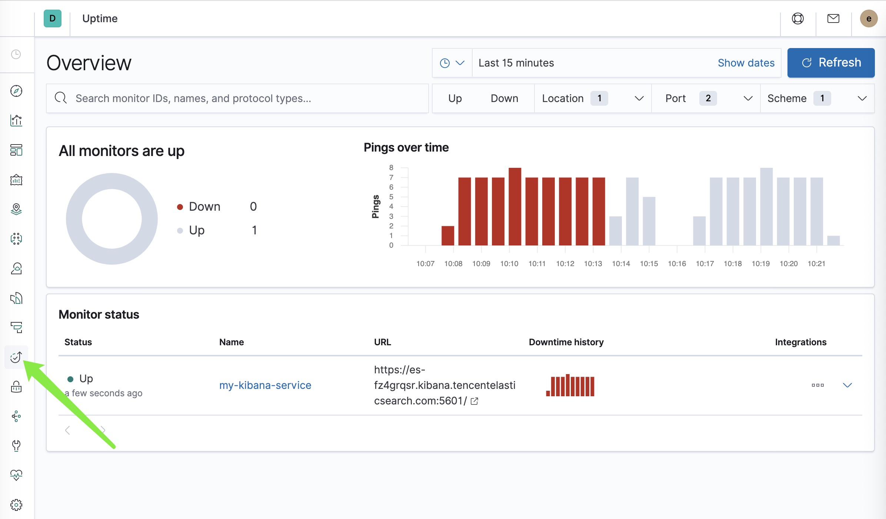


点击这个名为 ‘my-kibana-service’ 的连接查看，这个采集点的监控结果。

最后在命令行里按 `ctrl + c` 终止 ‘heartbeat -e’ 命令。然后运行一下命令，启动 heartbeat 后台服务。


```
systemctl start heartbeat-elastic.service
systemctl enable  heartbeat-elastic.service 
systemctl status  heartbeat-elastic.service 
```

Negative
: 注意：请确保 Heartbeat 服务处于正常的运行状况，检查本地 Kibana 服务的监控检查探针工作正常。


## STEP1：指标采集
Duration: 25

Positive
: 操作系统和各个应用模块的指标高低，以及网络流量的状态，是基础的运维分析数据，要处于无形部署，按需使用的程度。

### 安装 Metricbeat

通过网络安装 Metricbeat 软件包。

命令如下：

```sh
yum install -y https://mirrors.cloud.tencent.com/elasticstack/7.x/yum/7.10.1/metricbeat-7.10.1-x86_64.rpm
```

进入 Metricbeat 的配置文件目录` cd /etc/metricbeat/`，查看 Metricbeat 的配置目录，熟悉目录中的结构和文件。


### 初始化 Metricbeat 服务

在命令行下运行下面的两条命令，在执行前根据下面的参数解释，替换其中的三个参数。

```sh
metricbeat setup -e   --index-management   --dashboards \
  -E output.elasticsearch.hosts=['172.21.16.16:9200']   \
  -E output.elasticsearch.username=elastic   \
  -E output.elasticsearch.password=Elastic@1234#   \
  -E setup.kibana.host=es-fz4grqsr.internal.kibana.tencentelasticsearch.com:5601
```

命令参数解释：

* setup 命令会初始化相关索引和配套的管理策略 ， 这个步骤可能会持续 2~3 分钟。
* elasticsearch.hosts Elasticsearch 集群的内网服务地址
* elasticsearch.password 账号 elastic 的密码
* setup.kibana.host 内网 Kibana 的访问地址

等待该命令的执行结束后，会输出类似如下的信息。

```
template metricbeat-7.10.1 to Elasticsearch
2020-12-16T15:55:02.537+0800    INFO    template/load.go:101    template with name 'metricbeat-7.10.1' loaded.
2020-12-16T15:55:02.538+0800    INFO    [index-management]      idxmgmt/std.go:293      Loaded index template.
2020-12-16T15:55:03.092+0800    INFO    [index-management]      idxmgmt/std.go:304      Write alias successfully generated.
Index setup finished.
Loading dashboards (Kibana must be running and reachable)
2020-12-16T15:55:03.092+0800    INFO    kibana/client.go:117    Kibana url: http://es-fz4grqsr.internal.kibana.tencentelasticsearch.com:5601
2020-12-16T15:55:03.620+0800    INFO    kibana/client.go:117    Kibana url: http://es-fz4grqsr.internal.kibana.tencentelasticsearch.com:5601
2020-12-16T15:55:04.838+0800    INFO    add_cloud_metadata/add_cloud_metadata.go:89     add_cloud_metadata: hosting provider type not detected.
2020-12-16T15:57:25.194+0800    INFO    instance/beat.go:780    Kibana dashboards successfully loaded.
Loaded dashboards
```

在 Kibana 中查看 metricbeat 的索引、索引管理策略和相关的仪表板。

* 点击左侧 `Dashboard` 图标，查看 Metricbeat 相关的仪表板。
* 点击左侧 `Management` 图标，点击 Elasticsearch --> Index Lifecycle Policies 选项，在策略清单中选中 ‘metricbeat-7.10.1’， 在页面的底部，找到 Delete phase 部分，点击激活删除策略，在 ‘Timing for delete phase’ 中输入 `120` 这意味着，rollover 之后的数据文件中，超过了 `120` 天的数据就会被删除。目前这个演示系统并没有使用 热-温-冷 等复杂的索引数据生命周期管理策略。
* 点击 ‘heartbeat-7.10.1’ 的策略，也设置同样的这个 120 天删除的策略。后续的索引初始化配置完毕之后，也在这里做相同的操作。从而熟悉掌握这个配置。


### 编辑主配置文件

备份和查看默认的主配置文件 `metricbeat.yml `；并将其替换为以下内容。

```
#=========================== Modules configuration ============================
metricbeat.config.modules:
  path: ${path.config}/modules.d/*.yml
  reload.enabled: true
  reload.period: 10s

#=========================== Elasticsearch output =============================
output.elasticsearch:
  hosts: ["172.21.16.16:9200"]
  username: "elastic"
  password: "Elastic@1234#"

#=============================== Processors ===================================
processors:
  - add_host_metadata: 
      netinfo.enabled: true
      cache.ttl: 5m
      geo:
        name: bj-dc-01
        location: 35.5528, 116.2360
        continent_name: Asia
        country_iso_code: CN
        region_name: Beijing
        region_iso_code: CN-BJ
        city_name: Beijing 
  - add_cloud_metadata: ~
  - add_docker_metadata: ~
  - add_kubernetes_metadata: ~
  - add_fields:
      target: ''
      fields:
        service.name: 'Pet Clinic'
        service.id: 'petclinic-vm'

#==================== Best Practice Configuration ==========================
setup.ilm.check_exists: false
logging.level: error
queue.spool: ~
monitoring.enabled: true
```

以上个别参数解释：

* output.elasticsearch 部分配置了，Elasticsearch 集群的内网访问地址，elastic 的账户密码
* netinfo.enabled: true 收集所有网卡的配置信息
* service.name 和 service.id 设定运行在本操作系统上的应用系统的名字，用于丰富每一个指标采集点的元数据
* setup.ilm.check_exists: false 禁用索引 ilm 策略检查，避免无用动作
* logging.level: error 把Beats自身的日志记录调到最低级别降低
* queue.spool: ~ 开启本地默认的端点缓存行为

注意：这个配置文件中的 Elasticsearch 部分使用了管理员账户信息，在生产上不推荐这么做，请参考这篇文章将其替换为密码形式配置。 https://martinliu.cn/posts/beats-implement-on-qcloud/

测试配置文件是否语法正确。在提示 `OK` 的情况下，启用并开启 metricbeat 的后台指标采集服务。

```
metricbeat test config
metricbeat test output

systemctl enable  metricbeat
systemctl start  metricbeat
systemctl status  metricbeat
```


### 查看相关仪表板

Metricbeat 采集代理程序默认会启用操作系统指标采集的模块，setup 命令会一次性的将所有 Metricbeat 预制的上百种仪表板加载到后台，供 Kibana 浏览和搜索指标数据使用。

查看 Metricbeat 的相关仪表板

1. 打开 Kibana 界面
2. 打开左侧菜单栏，点击 ‘Dashboard’ 选项
3. 在页面的搜索框中输入 system 后，查看 Metricbeat 自带的仪表板，它们是 setup 命令导入的。
4. 点击查看名为 “[Metricbeat System] Overview ECS” 的仪表板。
5. 在 System Overview 和 Host Overview 的两个视图中切换查看

Host Overview 的显示结果如下。

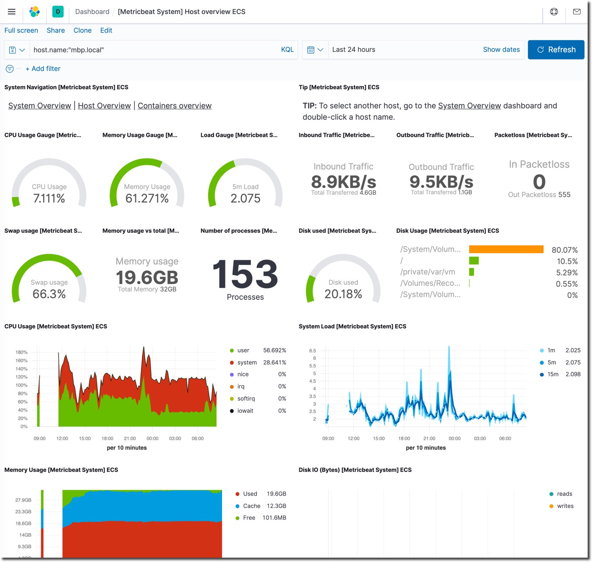

视图解释说明：

* System Overview  是当前所有被监控系统的指标统计汇总
* Host Overview 是某一个操作系统的监控指标展示

### 启用 Nginx 监控模块

Metricbeat 默认采集系统的指标。我们之前在这个服务器上安装了 Nginx，下面启用 Metricbeat 对 Nginx 的监控模块。

```
metricbeat modules enable nginx
metricbeat modules list
```

首先，需要修改 Nginx 服务器的配置文件，启用 Nginx 的 [ngx_http_stub_status](http://nginx.org/en/docs/http/ngx_http_stub_status_module.html) 模块。 编辑 /etc/nginx/nginx.conf 文件，在 Server 段落中增加以下内容。

```
        location /server-status {
            stub_status on;
            access_log off;
        }
```

修改好之后，重启 Nginx 服务，并测试验证该模块是否已经启用。

```
systemctl restart nginx
curl localhost/server-status
```

其次，查看一下 Metricbeat 的 nginx 的配置文件，并不需要做任何修改。

```
cat /etc/metricbeat/modules.d/nginx.yml 
```

最后，在浏览器的网址中输入 CentOS 的外网 IP 地址，访问 Nginx 的默认页面，产生一些流量。然后在 Dashboard 中搜索并查看 Nginx 的仪表板。如下图所示：

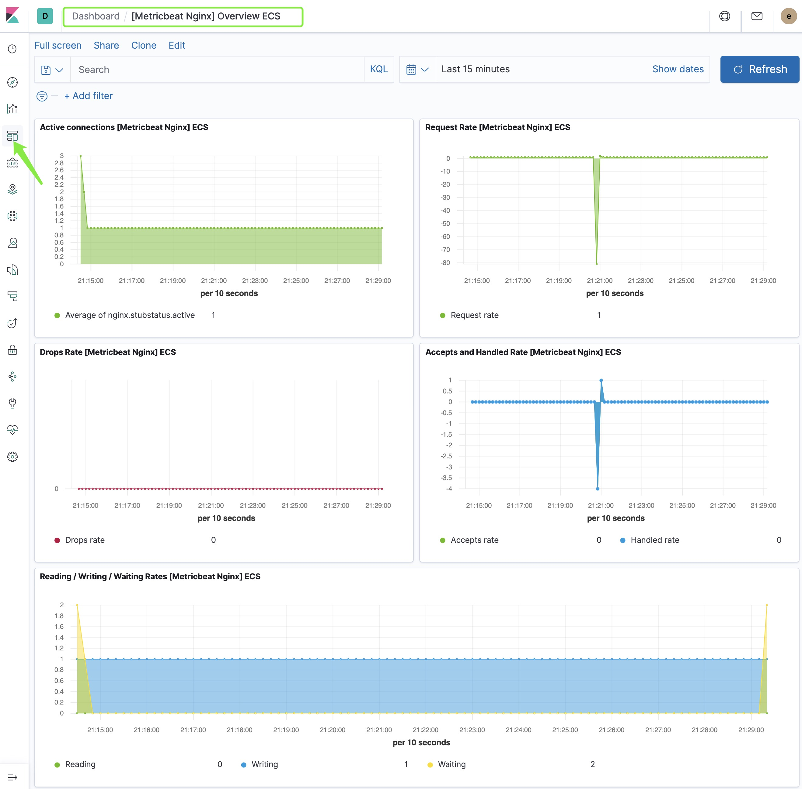


### 查看 Metrics 应用

在 Kibana 的左侧栏菜单中，点击 ‘Metrics’ 图标。


在这里可以做Uptime、指标、日志和 APM 的关联分析浏览。点击 ‘View metrics’ 后查看这台 CentOS 虚拟机的监控指标。

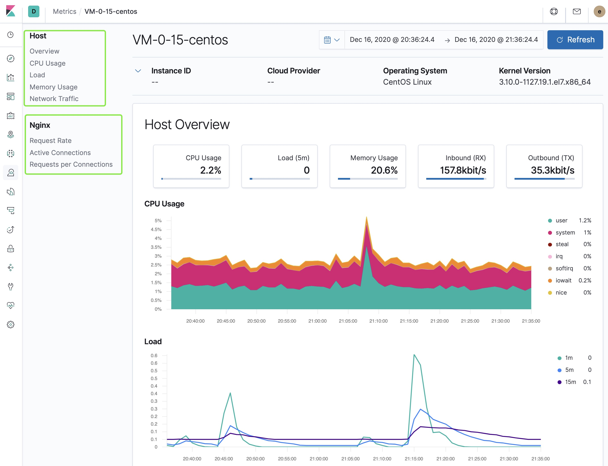


如上图所示，我们看到 ‘Host’ 下面显示了系统监控指标的几个指标；‘Nginx’ 下面显示了 Nginx 的相关指标。

在后续的课程中，我们逐步添加基于主机的日志关联分析，和 APM 关联分析。

Negative
: 注意：请确保 Metricbeat 服务处于正常的运行状况，Kibana 的 Metrics 应用可以正常显示数据。

## STEP2：日志采集 
Duration: 25

Positive
: 构建元数据标准丰富的高维度、全覆盖日志采集系统是终结手工捞日志看的前提，
；应用日志和采集工具配合得当的情况下，你将挖到运维管理的第一桶金。

### 安装 Filebeat

通过网络安装 Filebeat 软件包。命令如下：

```
yum install -y https://mirrors.tencent.com/elasticstack/7.x/yum/7.10.1/filebeat-7.10.1-x86_64.rpm
```

进入 `cd /etc/metricbeat/` 目录，熟悉 Filebeat 配置文件的目录结构和内容。

### 初始化 Filebeat 服务

在命令行下运行下面的两条命令，在执行前根据下面的参数解释，替换其中的四个参数。

```
filebeat setup -e   --index-management   --dashboards \
  -E output.elasticsearch.hosts=['172.21.16.16:9200']   \
  -E output.elasticsearch.username=elastic   \
  -E output.elasticsearch.password=Elastic@1234#   \
  -E setup.kibana.host=es-fz4grqsr.internal.kibana.tencentelasticsearch.com:5601
```

命令参数解释：

* setup 命令会初始化相关索引和配套的管理策略 ， 这个步骤可能会持续 2~3 分钟。
* elasticsearch.hosts Elasticsearch 集群的内网服务地址
* elasticsearch.password 账号 elastic 的密码
* setup.kibana.host 内网 Kibana 的访问地址

等待该命令的执行结束后，会输出类似如下的信息。

```
2020-12-16T22:01:36.164+0800    INFO    template/load.go:169    Existing template will be overwritten, as overwrite is enabled.
2020-12-16T22:01:36.343+0800    INFO    template/load.go:109    Try loading template filebeat-7.10.1 to Elasticsearch
2020-12-16T22:01:36.535+0800    INFO    template/load.go:101    template with name 'filebeat-7.10.1' loaded.
2020-12-16T22:01:36.535+0800    INFO    [index-management]      idxmgmt/std.go:293      Loaded index template.
2020-12-16T22:01:36.806+0800    INFO    [index-management]      idxmgmt/std.go:304      Write alias successfully generated.
Index setup finished.
Loading dashboards (Kibana must be running and reachable)
2020-12-16T22:01:36.806+0800    INFO    kibana/client.go:117    Kibana url: http://es-fz4grqsr.internal.kibana.tencentelasticsearch.com:5601
2020-12-16T22:01:37.217+0800    INFO    kibana/client.go:117    Kibana url: http://es-fz4grqsr.internal.kibana.tencentelasticsearch.com:5601
2020-12-16T22:01:39.076+0800    INFO    add_cloud_metadata/add_cloud_metadata.go:89     add_cloud_metadata: hosting provider type not detected.
2020-12-16T22:02:30.008+0800    INFO    instance/beat.go:780    Kibana dashboards successfully loaded.
Loaded dashboards
```

在 Kibana 中查看 filebeat 的索引、索引管理策略和相关的仪表板。

* 点击左侧 `Dashboard` 图标，查看 Filebeat 相关的仪表板。
* 点击左侧 `Management` 图标，点击 Elasticsearch --> Index Lifecycle Policies 选项，在策略清单中选中 ‘filebeat-7.10.1’， 在页面的底部，找到 Delete phase 部分，点击激活删除策略，在 ‘Timing for delete phase’ 中输入 `120` 这意味着，rollover 之后的数据文件中，超过了 `120` 天的数据就会被删除。目前这个演示系统并没有使用 热-温-冷 等复杂的索引数据生命周期管理策略。

本步骤是一次性的，在后续的其它被管理节点上就不需要再次执行 Beats 的任何 setup 命令了。

### 编辑主配置文件

查看默认的主配置文件 `filebeat.yml `；确保配置文件中具有以下内容。


```
#=========================== Filebeat inputs =============================
filebeat.inputs:
- type: log
  enabled: true
  paths:
    - /var/log/*.log

#============================= Filebeat modules ===============================
filebeat.config.modules:
  path: ${path.config}/modules.d/*.yml
  reload.enabled: true
  reload.period: 60s

#-------------------------- Elasticsearch output ------------------------------
output.elasticsearch:
  hosts: ["172.21.16.16:9200"]
  username: "elastic"
  password: "Elastic@1234#"

#================================ Processors =====================================
processors:
  - add_host_metadata: 
      netinfo.enabled: true
      cache.ttl: 5m
      geo:
        name: bj-dc-01
        location: 35.5528, 116.2360
        continent_name: Asia
        country_iso_code: CN
        region_name: Beijing
        region_iso_code: CN-BJ
        city_name: Beijing 
  - add_cloud_metadata: ~
  - add_docker_metadata: ~
  - add_kubernetes_metadata: ~
  - add_fields:
      target: ''
      fields:
        service.name: 'Pet Clinic'
        service.id: 'petclinic-vm'

#==================== Best Practice Configuration ==========================
setup.ilm.check_exists: false
logging.level: error
queue.spool: ~
monitoring.enabled: true
```

以上参数解释：

* netinfo.enabled: true 收集所有网卡的配置信息
* service.name 和 service.id 是运行在本操作系统上的应用系统的名字
* 以上配置信息中的 `output.elasticsearch` 需要修改为你的 Elasticsearch 集群的 elastic 账号信息。

测试配置文件是否语法正确。在提示 `OK` 的情况下，启用并开启 filebeat 的日志采集服务。

```
filebeat test config
filebeat test output
filebeat -e
```
如果以上命令不报错的话，继续下面的步骤启用 Filebeat 模块和启动 Filebeat 服务。

Filebeat 的 processors 处理器机制可以实现丰富的日志字段丰富和处理，基于 Elastic ECS 通用数据定义的日志元数据丰富在本课程中不作讲解。请大家课后深入学习。另外应用程序和日志采集工具的配合也不在此做深入讨论，请开发者在设计程序的日志输出机制时，同时考虑到后期的日志采集工具。

### 初始化和运行 Filebeat 服务

启用 Filebeat 的系统日志采集和 Nginx 服务日志采集。

```
filebeat  modules enable system nginx
```


```
systemctl enable  filebeat
systemctl start  filebeat
systemctl status  filebeat
```

到目前为止实现了 Filebeat 日志采集代理的后台相关组件初始化，Filebeat 采集代理开始持续的采集操作系统的日志。

### 查看 Filebeat 相关仪表板


查看 Filebeat 的相关仪表板

1. 打开 Kibana 界面
2. 打开左侧菜单栏，点击 ‘Dashboard’ 选项
3. 在页面的搜索框中输入 system 后，查看 Filebeat 自带的仪表板，它们是 setup 命令导入的。
4. 点击查看名为 “[Filebeat System] Syslog dashboard ECS” 的仪表板。

该仪表板内有若干个可以切换的视图：

* Syslog
* Sudo commands
* SSH logins
* New users and groups

Syslog 视图的显示效果如下：


点击 ‘SSH logins’ 后可以查看 SSH 登录统计，如下图所示。


在 Dashboard 的搜索框中搜索并查看 ‘[Filebeat Nginx] Overview ECS’ Nginx 服务器的日志分析仪表板，如下图所示。

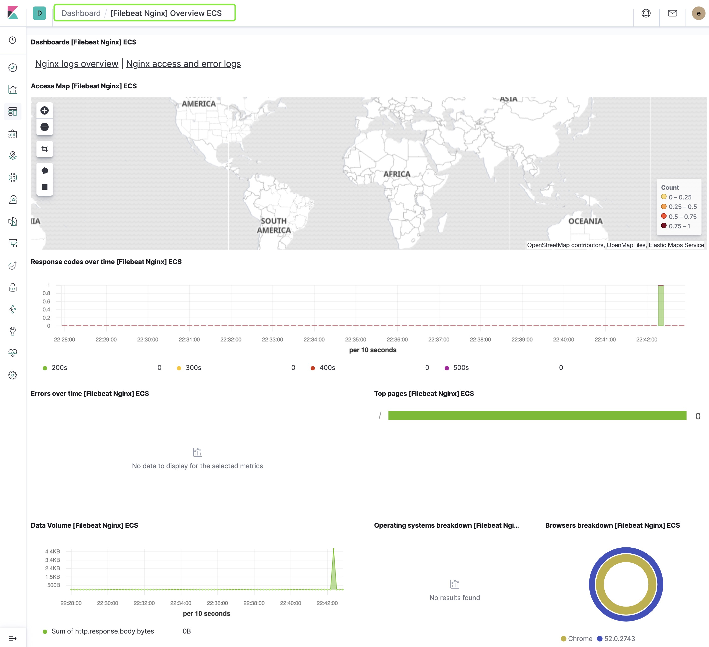


### 查看 Logs 应用

在 Kibana 的左侧栏菜单中，点击  ‘Logs’ 图标。

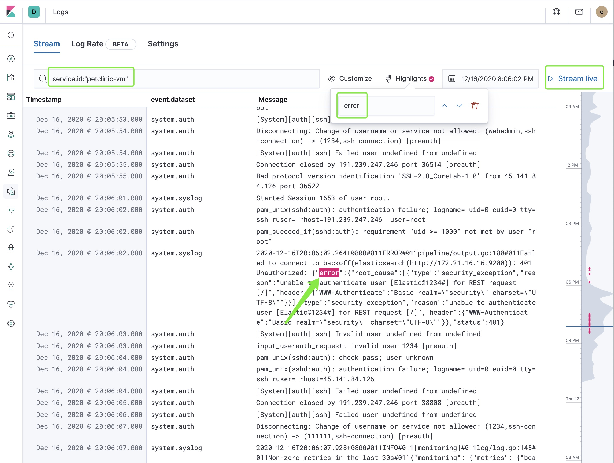


在这个统一的日志流查看界面中，尝试使用以上三个高亮的功能：

1. 按日志字段搜索：尝试搜索 `service.id: petclinic-vm`
2. 日志高亮显示：输入屏幕上能看到的预期存在的关键词，观察屏幕上的变化，特别是最右侧的波形图的变化。
3. 点击 `Stream live ` 开启日志数据实时数据流功能，这个功能近似于 tial -f 的查看日志文件的更新。


打开 ‘Metric’ 菜单中的主机查看模式，点击主机图标，打开主机关联数据查看菜单，选择 `Host Logs` 选项。

Negative
: 注意：到目前为止，本课程实现了基于主机的操作系统syslog日志采集，并且使用了 Kibana 中自带的可观测性数据关联查看分析能力。


## STEP3：APM 全堆栈追踪
Duration: 30

### 安装 APM 服务器

Positive
: APM 追踪听起来有点难，但是先做的人总是先得到意外的惊喜；最重要的是做 APM、日志和指标三个维度数据的关联分析。

安装 APM Server 软件。

```
yum install -y https://mirrors.cloud.tencent.com/elasticstack/7.x/yum/7.10.1/apm-server-7.10.1-x86_64.rpm
cd /etc/apm-server/
```

在 APM 服务器的配置目录中，查看主配置文件 `apm-server.yml` 的默认内容，确保其中的内容至少包含以下内容。

```
apm-server:
  host: "0.0.0.0:8200"
  rum:
    enabled: true
output.elasticsearch:
  hosts: ["172.21.16.16:9200"]
  username: "elastic"
  password: "Elastic@1234#"
```

或者用以上的内容替换默认的配置文件。

配置参数含义：

* 设置 APM 服务器对外部所有网络地址提供服务，端口为 8200
* 启用实时用户体验监控
* 指向运行在本机的 Elasticsearch 服务


在命令行下初始化 APM 服务器。命令相同。

```
apm-server test config
apm-server test output

apm-server setup
apm-server -e
```
观察服务的日志，在没有报错的情况下，启动 apm-server 后台服务。

首先修改一些文件的属性，然后启动 APM 服务。

```
chown apm-server:apm-server /var/lib/apm-server/meta.json
chown apm-server:apm-server /etc/apm-server/apm-server.yml
chmod 0600 /etc/apm-server/apm-server.yml
systemctl start  apm-server
systemctl enable  apm-server
systemctl status  apm-server
```

以上最后一条命令应该显示 APM 服务器处于正常运行状态。

### 运行宠物诊所演示程序

首先确认一下当前操作系统中 JDK 的版本号，没有的话需要自行安装。

```
java --version
openjdk 11.0.8 2020-07-14
OpenJDK Runtime Environment AdoptOpenJDK (build 11.0.8+10)
OpenJDK 64-Bit Server VM AdoptOpenJDK (build 11.0.8+10, mixed mode)
```

进入 git clone 下载的目录中 `cd elastic-labs-qq/`。查看 `ls petclient/elastic-apm-agent-1.18.1.jar`  文件。该文件和示例程序在同一个文件夹中。

启动宠物诊所后台的核心应用服务，并且同时挂载 `javaagent` 代理。

```
java -javaagent:elastic-apm-agent-1.18.1.jar -Delastic.apm.service_name=petclinic-spring -Delastic.apm.server_urls=http://localhost:8200 -jar spring-petclinic-1.5.16.jar
```

启动参数简介：

* 声明该服务的名称为 petclinic-spring
* 加载 elastic java agent 的 jar 文件
* 配置 APM 服务器的位置网址
* 另外这个用默认使用了内置的数据库

上面的这条命令会启动宠物诊所演示应用系统的后台服务，并加载了Elastic APM 对 Java 应用的无痛埋点代理。

在一个新的 SSH 登录窗口中，启动宠物诊所的前端应用，这是一个 node.js 的应用，先确保当前练习的操作系统中已经安装了 node 的版本。

```
npm version
{ npm: '3.10.10',
  ares: '1.10.1-DEV',
  http_parser: '2.8.0',
  icu: '50.1.2',
  modules: '48',
  napi: '3',
  node: '6.17.1',
  openssl: '1.0.2k-fips',
  uv: '1.40.0',
  v8: '5.1.281.111',
  zlib: '1.2.7' }
```

进入前端应用的目录 `cd /root/elastic-labs-qq/petclinic/frontend` ，查看该应用的配置文件 `config.js` ，修改前两个参数为 CentOS 虚拟机的本地 IP 地址 和 公网 IP 地址，其内容如下：


```
var config = {
  apm_server: process.env.ELASTIC_APM_SERVER_URL || 'http://172.16.0.15:8200',
  apm_server_js: process.env.ELASTIC_APM_SERVER_JS_URL || 'http://188.131.151.204:8200',
  apm_service_name: process.env.ELASTIC_APM_SERVICE_NAME || 'petclinic-node',
  apm_client_service_name: process.env.ELASTIC_APM_CLIENT_SERVICE_NAME || 'petclinic-react',
  apm_service_version: process.env.ELASTIC_APM_SERVICE_VERSION || '1.2.0',
  api_server: process.env.API_SERVER || 'http://localhost:8080',
  api_prefix: process.env.API_PREFIX || '/petclinic/api',
  address_server: process.env.ADDRESS_SERVER || 'http://localhost:5000',
  distributedTracingOrigins: process.env.DISTRIBUTED_TRACINGS_ORIGINS || 'http://petclinic-client:3000,http://petclinic-server:8000,http://localhost:4000,http://localhost:8080,http://localhost:8081'
}
```

重要配置参数讲解：

* node.js 服务的名称和版本
* 前端应用服务器的地址和端口
* apm_server   node.js 应用服务器端连接 APM 服务器的网址
* apm_server_js node.js 应用客户端（远程用户浏览器）连接 APM 服务器的网址

这个应用前端的代码中已经进行了 Elastic APM 对 Node.js 应用的无痛埋点配置，在进行一个简单的依赖包安装命令后，启动该应用。

```
npm start
```

观察宠物诊所前端应用的正常启动过程。然后在浏览器中访问网址：` http://public_IP:4000/` ，访问公网 IP 的 4000 端口，如果宠物诊所系统的工作正常，应该看到如下界面。

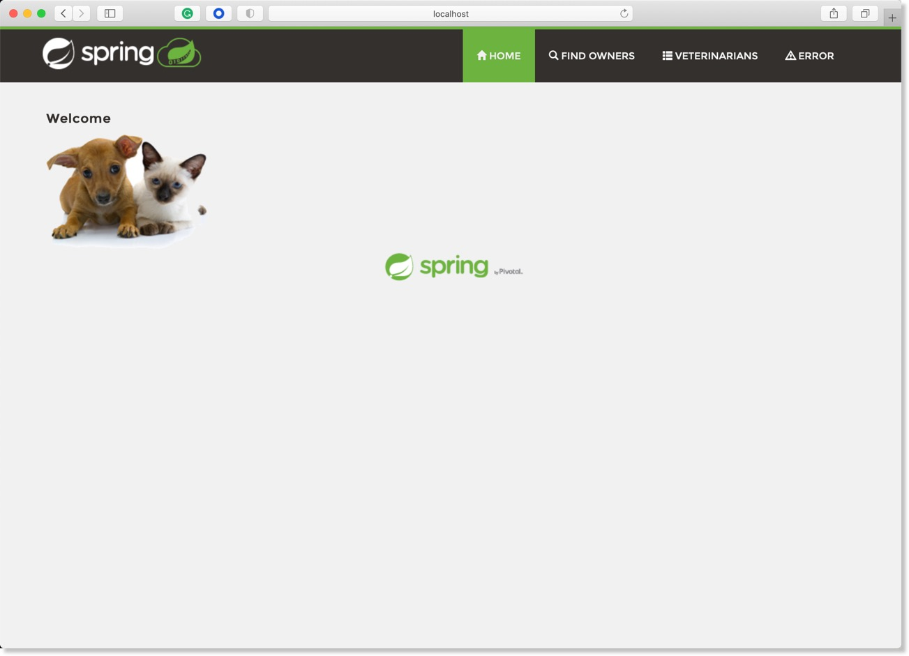

点击 Home 按钮右侧的其它三个菜单，多点击几次，制造一些人为的系统功能调用，目的是生成 APM 追踪数据。

下一步进入 APM 应用查看追踪数据结果。

### 查看 APM 应用

在 Kibana 的左侧栏菜单中，点击  ‘APM’ 图标。

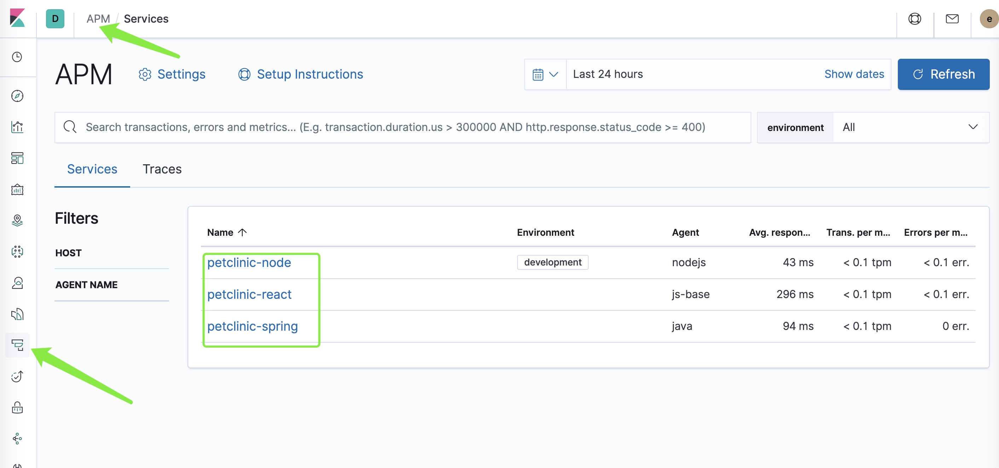


使用 APM 应用的界面查看上一步生成的追踪数据。

1. 点击每一个服务的详细信息，了解它的交易性能概要、报错、性能指标。
2. 点击服务地图查看宠物诊所这个多层应用的追踪信息。
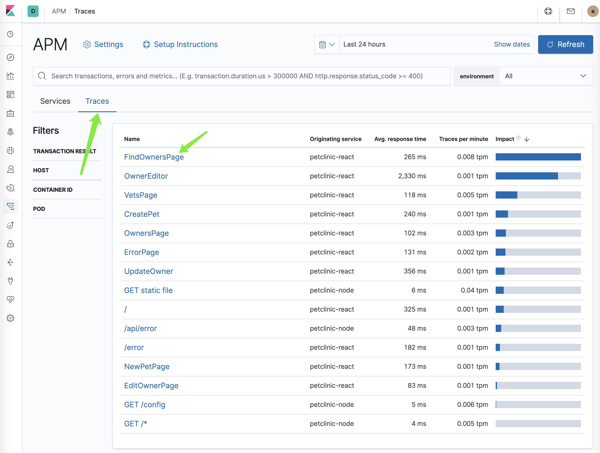


最后一步深度查看某个服务的详细交易追踪数据和关联数据查看。


### 配置 Nginx 为宠物诊所的反向代理

让 Nginx 代理所有 80 端口的访问到 node.js 访问的 4000 端口上。

修改 nginx.conf 配置文件，在 `location` 这个段落中增加一行。

```
        location / {
            proxy_pass http://localhost:4000;
        }
```

重启 nginx 服务器。

```
systemctl restart nginx
systemctl status nginx
```

在 Nginx 服务状态正常的情况下，在浏览器中访问 CentOS 虚拟机的公网 IP 地址。例如：`http://188.131.151.204/` 。你将依然能够正常访问宠物诊所应用的所有页面。

### 增加宠物诊所应用系统的健康检查探针

在宠物诊所系统正常运行的状态下，在 Heartbeat 的健康检查系统中增加一个新的用于检查改服务前端的探针。

进入 `/etc/heartbeat/monitors.d` 目录。添加一个名为 `petclinic.yml` 内容如下的配置文件。

```
- type: http
  id: Petclinic-100
  name: Petclinic-Svc
  schedule: '@every 5s' 
  hosts: ["http://188.131.151.204/"]
  ipv4: true
  ipv6: true
  mode: any
```

等待5 秒后，观察 Uptime 的界面，名为`Petclinic-Svc` 的服务应该出现，该探针将持续监控前端服务的 4000 端口，并返回健康检查的结果到 Uptime 应用中。有可能需要重启一下 heartbeat 服务。

再添加一个名为 `ext-svc.yml` 内容如下的配置文件。

```
- type: http
  id: Elastic-100
  name: Elastic-cloud
  schedule: '@every 5s' 
  hosts: ["https://cloud.elastic.co"]
  ipv4: true
  ipv6: true
  mode: any
```

等待5 秒后，观察 Uptime 的界面，名为`Elastic-cloud` 的服务应该出现，并返回健康检查的结果到 Uptime 应用中。


## 实施服务质量监控
Duration: 20

Positive
: 可观测性监控管理的王冠是实现“基于服务质量目标（SLO）”的监控。设定 SRE 风格的服务质量目标，进入 P90、P95、P99 的 n 个 9 的监控风格是目前的趋势。

使用 Canvas 的画布功能，定制如下的 SLO 监控大屏。

### 创建 heartbeat-* 索引模式

点击 Kibana 界面左下角的 management 图标，点击 `index pattern` ，点击 `Create index pattern` 按钮，输入 ‘heartbeat-*’ 后，点击 `Next step` 按钮

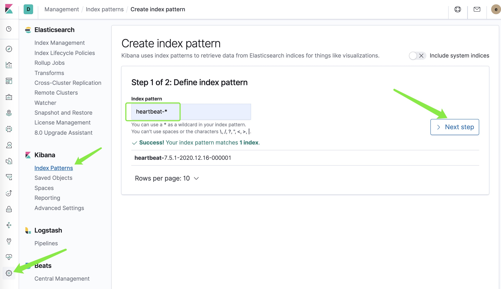

在 `Time Filter field name` 下方，选择 @timestamp 字段，最后点击 点击 `Create index pattern` 按钮。

在 Kibana 的 Discovery 功能里查看，刚才创建的` heartbeat-* `索引模式，增加 monitor.name等于 Petclinic-Svc 的过滤器，详细查看一条监控数据的所有字段。

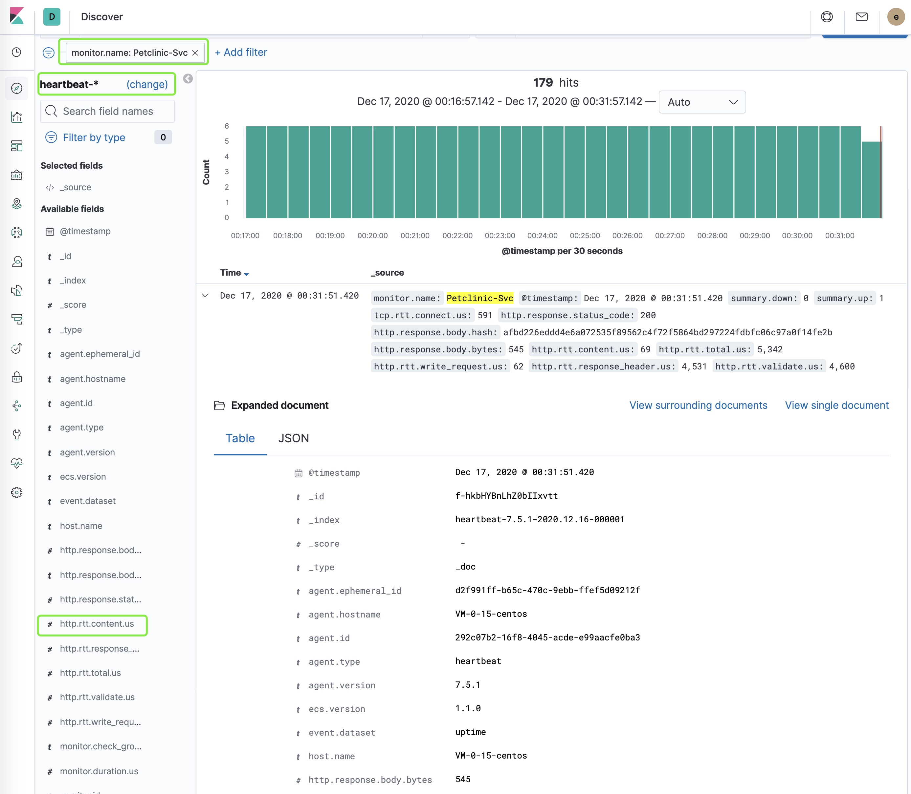

点击左侧的 ‘http.rtt.total.us’ ，查看宠物诊所前端 HTTP 访问延迟的探针检测数值的分布情况。

### 创建宠物诊所前端 HTTP 延迟监控图表

在 Kibana 中，使用 TSVB 时序数据可视化分析控件，分析和展示 Heartbeat 健康检查探针的监控结果。

在 Kibana 的左侧菜单中，点击 Visualize 图标，点击 Create visualization 按钮，选择 TSVB 控件。


在 Panel options 中输入查询条件。

* Index pattern : heartbeat-*
* Time field : @timestamp
* Panel filter : monitor.id : "Petclinic-100" 

如下图所示：


在 Data 这一个标签也中创建如下图所示的三个时序数据绘制曲线。


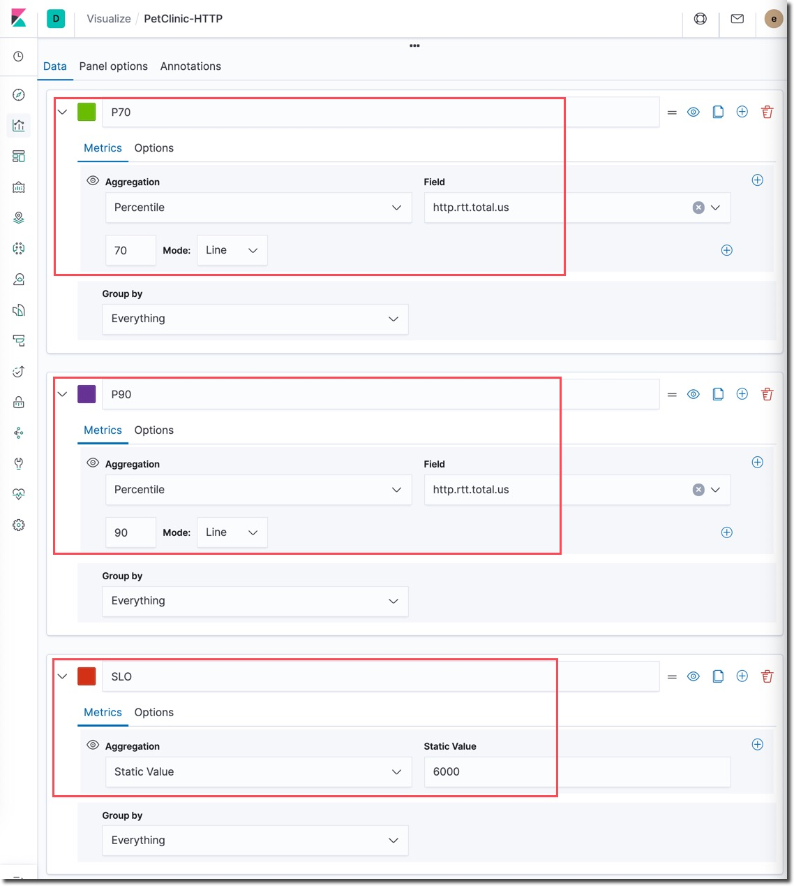

相关字段解释：

* Aggregation : Percentile 是对 field 的数据做的百分位聚会运算，得出该指标在 p70，p90 下的表现。
* Field : 选择的是 http.rtt.total.us ，这是 Heartbeat 的 HTTP 探针采集到的某个 http 端点的延迟时长，单位是 us。
* Aggregation : Static Value 是对在图形上画一根静态的线，加上这个指标就是我们选中的宠物诊所应用系统的 SLI 之一，它反映出页面打开的延迟速度，我们对其设置的 SLO 管理目标是 6000。在 Options 的选项中将参数 Fill (0 to 1) 设置为 0 。

点击右上角的 Refresh 按钮，还可以在这个按钮的左侧菜单中选择不同的观测时段。

最后，点击页面左上角的 Save 链接， 保存当前的 TSVB 可视化分析图表，保存名称为 ‘PetClinic-HTTP’

分析你目前所掌握的来自 heartbeat、filebeat、metricbeat 的数据，参考已有的 Dashboard 的数据，根据 SRE 梳理和定制 SLI 的方法，推荐参考书籍《Google SRE 工作手册》，将梳理出来的 SLI 都制作出以上风格的实施监控图表。

### SLO 创建服务质量监控仪表板

可以为每一套应用系统创建一个 SLO 服务质量监控仪表板，将该应用系统的所有 SLI 监控指标都放进去，SRE 工作手册推荐一套应用系统的 SLI 数量从精选的 3 到 5 个实际能影响最终用户使用体验的指标开始。

在 Kibana 中点击左侧的 Dashboard 图标，点击页面右侧的 Create dashboard 按钮，进入仪表板创建页面。

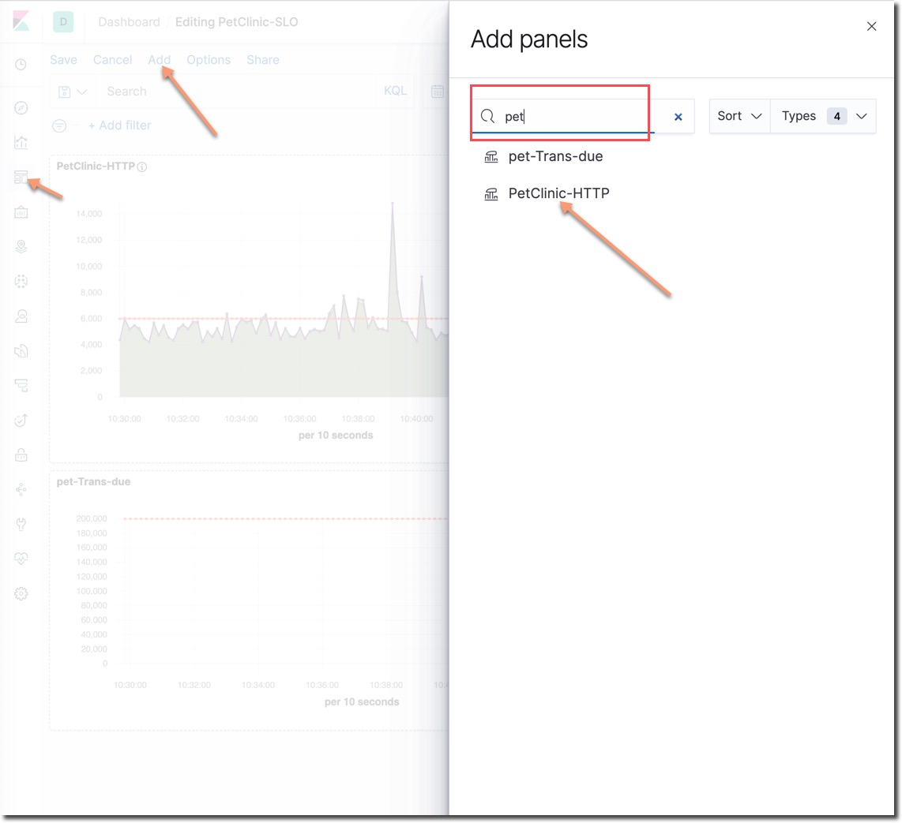

在以上页面中， 点击 Add 链接， 在搜索框中输入 pet ，选中上一步我们所创建的 TSVB 时序数据实时分析控件。用鼠标推动的方式调整这个控件在页面中的大小和位置。

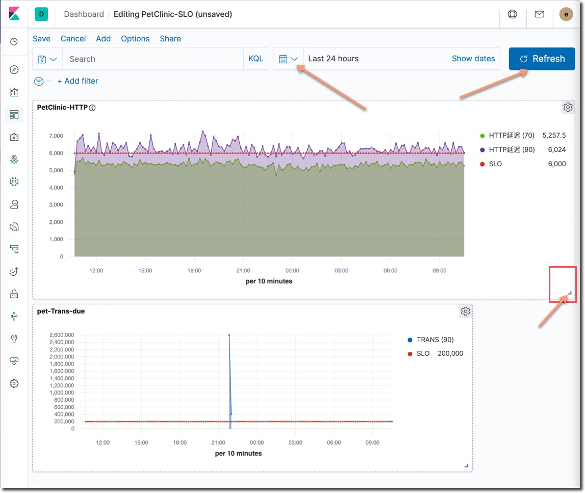

点击每个图表右下角的三角图表，以上每个数据显示控件的大小都可以调整，位置都可以拖动。

在点击日历图标之后，选择需要查看的监控时段，点击刷新按钮，更新这个仪表板中所有控件的数据。


下面这是一个自选练习，是一个 SLO 监控大屏示例。


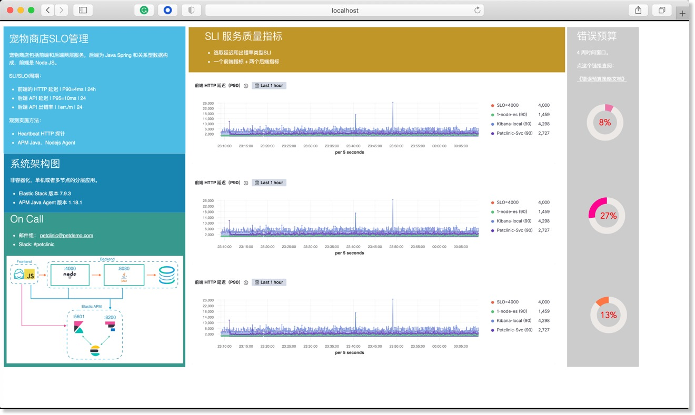

下载名为 [canvas-workpad-petclinic.json](canvas-workpad-petclinic.json) 的示例文件。

在 Kibana 左侧的菜单里选择 `Canvas` 画布菜单，点击 `Import workpad JSON file` 按钮，导入后既可以看到名为 `宠物商店：SLO管理监控大屏` 的监控画布。


Negative
: 本课程完成了 Elastic Stack 技术栈的所有主要功能模块的配置和使用。讲解了针对宠物医院这个多层次应用的可观测性构建，采集到了四个方面的可关联分析的时序数据流。还参考 SRE 的管理方法，创建了 SLI 的可视化数据指标监控图标，并为 SLI 设定了 SLO管理目标。最后将宠物诊所应用的所有 SLI/SLO 管理监控图表都集成到了一个统一的仪表板中。

