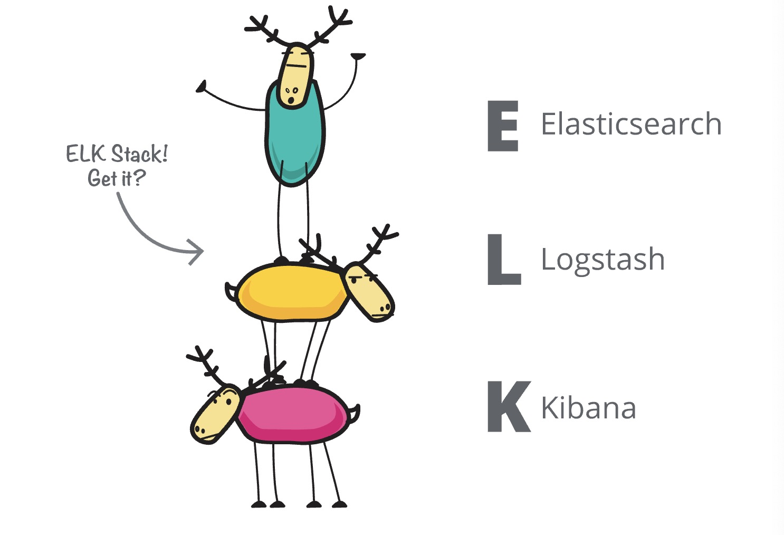
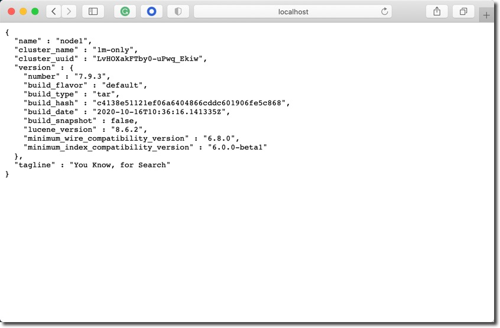
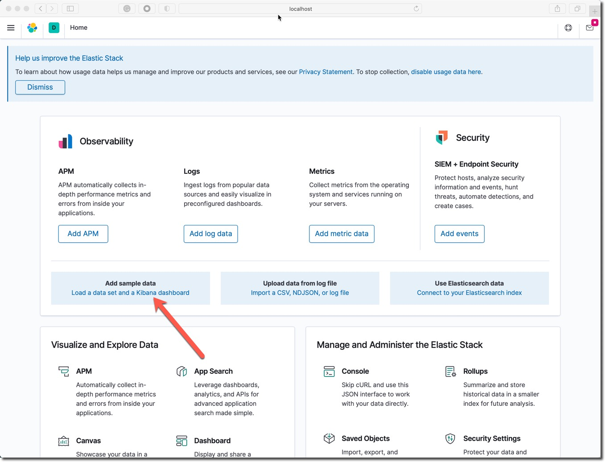
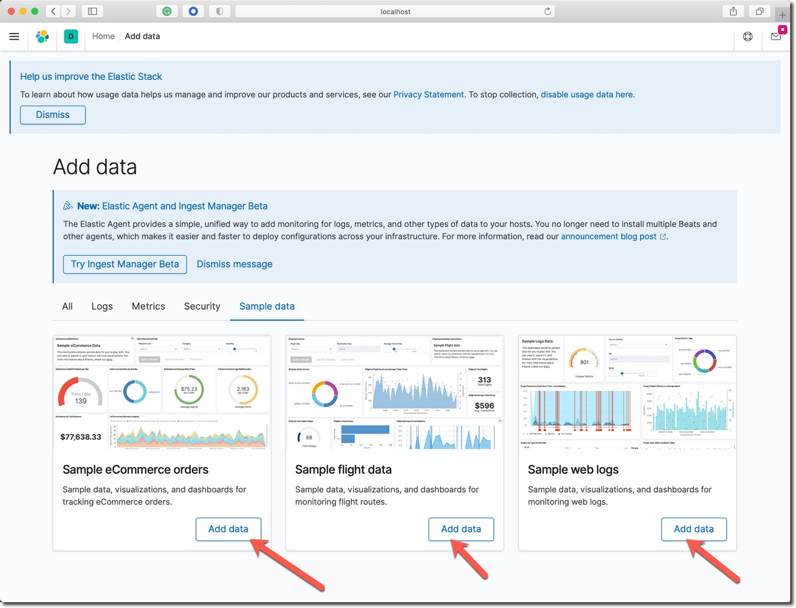
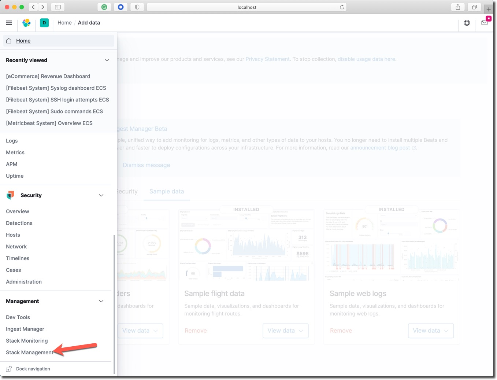
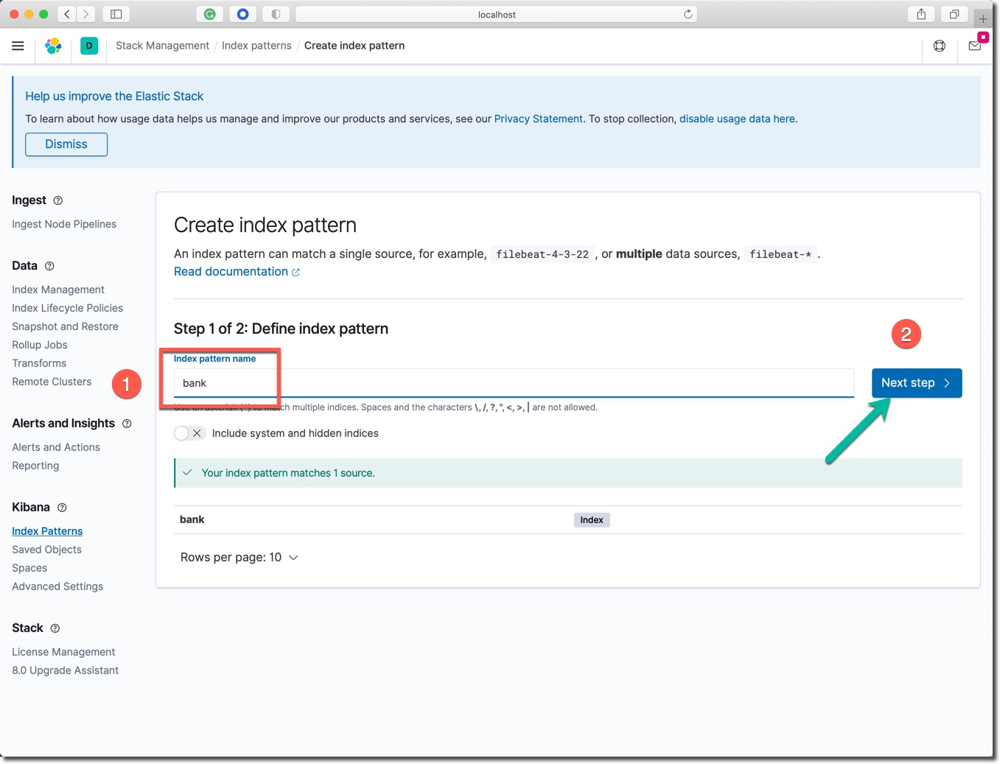
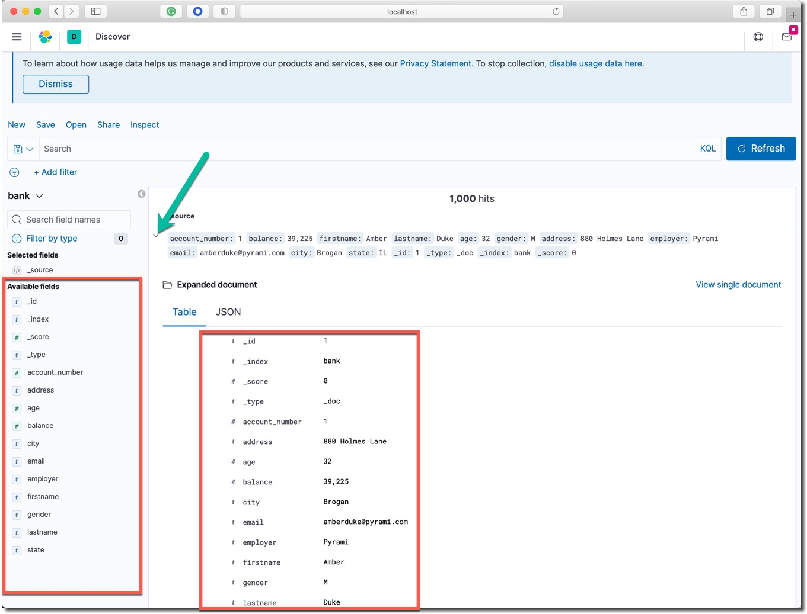

summary: 搭建单节点 Elasticsearch 集群服务(AWS)
id: one-nodes-es-server-aws
categories: elasticsearch
tags: elasticstack
status: Published 
authors: Martin Liu
Feedback Link: https://github.com/martinliu/martinliu.github.io/discussions
Analytics Account: UA-159133967-1


# 搭建单节点 Elasticsearch 集群服务(AWS)
<!-- ------------------------ -->
## 概述
Duration: 1

### 学习收益

你将学习到以下技能：

1. 下载并运行 Elasticsearch 服务器
2. 在服务器中索引一些文档（使用 _index API）
3. 体验搜索查询 （使用 _search API）
4. 尝试数据分析聚合 （使用 _search API）
5. 下载并运行 Kibana 服务器


本课程所有使用到的 Elastic Stack 程序文件和软件包都位于 AWS 测试环境虚拟机的 `ec2-user` 用户目录下。

* 本课程所使用的公共AMI操作系统镜像：宁夏区 `ami-0e5a0e294902966af` 北京区 `ami-0e1382088b62cb38d`
* 启动一台内存不低于 4GB 的 EC2 实例。
* elastic-stack ： 目录下存放着所有联系需要的程序文件和参考配置文件。 
* petclinic ： 目录下存放着宠物商店示例应用的所有文件。


### 参考信息

Elastic 官方参考文档：

* [Getting started with Elasticsearch](https://www.elastic.co/guide/en/elasticsearch/reference/current/getting-started.html)
* [Discovery and cluster formation settings](https://www.elastic.co/guide/en/elasticsearch/reference/current/modules-discovery-settings.html)
* [Bootstrap Checks](https://www.elastic.co/guide/en/elasticsearch/reference/current/bootstrap-checks.html#single-node-discovery)
* [Search your data](https://www.elastic.co/guide/en/elasticsearch/reference/current/search-your-data.html)
* [Aggregations](https://www.elastic.co/guide/en/elasticsearch/reference/current/search-aggregations.html)

Elastic Stack 包含了我们常说的 ELK 或者 ELKB。如下图所示：


ELK 是 Elasticsearch、Logstash和Kinina的首字母缩写，ELK Stack是elastic公司三大核心产品的组合方案。




## 环境需求检查
Duration: 2

顺利完成本 Lab 的笔记本电脑的软硬件需求如下。

Positive
: 建议使用配置足够的笔记本电脑，能上网，可以快速访问 AWS 中国区的服务，已获取最佳体验。

### 硬件配置

* 4GB 内存或更多
* i5 及更高 CPU
* Wifi 或有线网络，能访问互联网。

### 软件配置

* MacOS 或 Windows 操作系统都可以。
* 终端命令行工具软件，例如： iTerm2、Terminal、 [cmder for Windows 10](https://cmder.net/)。
* curl、wget 或者其他的图形化下载工具。

### 准备 AWS EC2 实例

进入 AWS 中国区控制台 https://amazonaws.cn ； 在 EC2 服务中启动一个如下配置的实例，不低于以下配置

* 镜像选择，在 Community AMI 中搜索 `ami-0e1382088b62cb38d` (北京区) 或者 `ami-0e5a0e294902966af` （宁夏区）
* 实例类型选 `t3.medium`
* 磁盘不低于 `8` GB
* 启动后记录下该实例的 `共有 IP`

EC2 安全组开放如下入栈端口：

* TCP 8200 0.0.0.0/0
* TCP 4000 0.0.0.0/0
* TCP 9200 0.0.0.0/0
* TCP 22   0.0.0.0/0
* TCP 5601 0.0.0.0/0


Negative
: 打开SSH工具软件，成功的登录到目标 EC2 实例中，查看根目录下应该包含两个目录 `elastic-stack` 和 `petclinic` 。

## 运行 Elasticsearch 服务器
Duration: 5

Positive
: 在实操练习 EC2 虚拟机的 elastic-stack 目录中使用 Elasticsearch 服务器软件压缩包。


### 解压缩软件压缩包

进入软件包所在的 elastic-stack 目录中。解压缩 Elasticsearch 服务器端软件包。


```bash
tar -xvf elasticsearch-7.9.3-linux-x86_64.tar.gz
ls
```

目录中出现了名为 `elasticsearch-7.9.3` 的目录。

### 启动 Elasticsearch 服务

进入加压缩后的目录，并在命令行启动 Elasticsearch 服务器。


```bash
cd elasticsearch-7.9.3/bin
./elasticsearch -Ecluster.name=1m-only -Ediscovery.type=single-node -Enode.name=node1  -Enetwork.host=0.0.0.0
```

在启动日志停止滚动后，一个名为 `1m-only` 的单节点 Elasticsearch 集群就启动成功了。启动是参数说明如下：

* cluster.name ： 集群名称
* node.name : 节点名称
* discovery.type ：集群中节点间的发现方式，显式声明该集群中只有一个节点。
* network.host=0.0.0.0 : 设置 Elasticsearch 集群的访问面向任何网络开放。


在一个新的 EC2 SSH 访问的命令行窗口中用  `curl` 命令行工具测试 Elasticsearch 集群服务的状态。

查看服务的基本信息。

`curl -X GET http://localhost:9200`

```bash
curl -X GET http://localhost:9200
{
  "name" : "node1",
  "cluster_name" : "1m-only",
  "cluster_uuid" : "LvHOXakFTby0-uPwq_Ekiw",
  "version" : {
    "number" : "7.9.3",
    "build_flavor" : "default",
    "build_type" : "tar",
    "build_hash" : "c4138e51121ef06a6404866cddc601906fe5c868",
    "build_date" : "2020-10-16T10:36:16.141335Z",
    "build_snapshot" : false,
    "lucene_version" : "8.6.2",
    "minimum_wire_compatibility_version" : "6.8.0",
    "minimum_index_compatibility_version" : "6.0.0-beta1"
  },
  "tagline" : "You Know, for Search"
}

```

查看集群中节点的状态信息。

`curl -X GET http://localhost:9200/_cat/nodes\?v`

```bash
curl -X GET http://localhost:9200/_cat/nodes\?v
ip        heap.percent ram.percent cpu load_1m load_5m load_15m node.role master name
127.0.0.1           17          97   7    2.05                  dilmrt    *      node1
```

上面的 `master` 那一列下面的值为 `*` 号，表明节点 `node1` 是这个集群中唯一的主节点。


在浏览器中验证 Elasticsearch 集群服务的状态，打开浏览器中访问这个网址 `http://public_IP:9200` 。 使用浏览器访问 EC2 实例的公网 IP 的 `9200` 端口，访问结果应如下图所示：




然后尝试访问这个网址 `http://public_IP:9200/_cat/nodes\?v` 。

Negative
: 确保在命令行和浏览器中都能看到正确的集群名称、节点名称和软件版本号。当前处于开发模式的无密码访问模式，处于非安全的状态。

## 索引一些文档
Duration: 8

Positive
: 这个运行中的 Elasticsearch 集群提供着功能完整的 RESTFul API 服务，包括对索引和文档的增删改查（CURD）等操作。

### 索引单个和返回单个文档

索引一个文档，该文档只具有一个键值对数据 "name": "John Doe" 。

```bash
curl -X PUT "localhost:9200/customer/_doc/1?pretty" -H 'Content-Type: application/json' -d'
{
  "name": "John Doe"
}
'
```

注意：以上命令最后一行还有一个单引号。

以上命令的返回结果如下：


```
{
  "_index" : "customer",
  "_type" : "_doc",
  "_id" : "1",
  "_version" : 1,
  "result" : "created",
  "_shards" : {
    "total" : 2,
    "successful" : 1,
    "failed" : 0
  },
  "_seq_no" : 0,
  "_primary_term" : 1
}
```

以上的命令创建了名称为 `customer` 的新索引，并保存了第一个编号为 `1` 的文档。 

用下面的命令读取这个编号为 `1` 的文档。

```
curl -X GET "localhost:9200/customer/_doc/1?pretty"

```

返回的结果如下：

```
{
  "_index" : "customer",
  "_type" : "_doc",
  "_id" : "1",
  "_version" : 1,
  "_seq_no" : 0,
  "_primary_term" : 1,
  "found" : true,
  "_source" : {
    "name" : "John Doe"
  }
}

```


### 批量索引文档

在导入大量文档的时候，可以使用 [buck API](https://www.elastic.co/guide/en/elasticsearch/reference/7.9/docs-bulk.html) 进行批量索引（导入）的操作。


在 elastic-stack 目录中查看  `account.json` 文件，用 cat 命令浏览该文件中的 1000 条数据。

在命令行中，将以上测试数据文件批量导入到 Elasticsearch 服务中，运行下面的两条命令。

```
curl -H "Content-Type: application/json" -XPOST "localhost:9200/bank/_bulk?pretty&refresh" --data-binary "@accounts.json"

curl "localhost:9200/_cat/indices?v"
```

以上命令的结果，最后三行应该如下所示：

```
health status index    uuid                   pri rep docs.count docs.deleted store.size pri.store.size
yellow open   bank     Q_yO2ErRSRSgCXHu6eac-g   1   1       1000            0    382.2kb        382.2kb
yellow open   customer D9ijmP_iR225damqVPQwkw   1   1          1            0      3.8kb          3.8kb
```

上面的结果表明：当前的集群中已经创建了两个索引 `bank` 和 `customer` ; 名为 `bank` 的索引显示文档数为 1000，这就是刚才用 bulk API 导入的数据。

如果在浏览器中访问这个网址 `http://public_IP:9200/_cat/indices?v` 也可以看到如下相同结果。


Negative
: `_doc` 和 `_bulk` API 索引了单个和批量的数据文档。名为 `bank` 和 `customer` 的索引也在过程中被创建。

## 测试搜索功能
Duration: 6

Positive
: 使用 _search API 进行搜索，Elasticsearch [Query DSL](https://www.elastic.co/guide/en/elasticsearch/reference/current/query-dsl.html) 有一整套的搜索能力。


### 搜索 1 

说明：

* 目标 bank 索引
* 搜索所有文档
* 结果按 account_number 字段升序排列

在命令行执行下面的命令。

```
curl -X GET "localhost:9200/bank/_search?pretty" -H 'Content-Type: application/json' -d'
{
  "query": { "match_all": {} },
  "sort": [
    { "account_number": "asc" }
  ]
}
'
```

执行结果解释：

* took – Elasticsearch 执行本次查询使用了多少毫秒
* timed_out – 是否查询超时
* _shards – 有多少个数据分片参与了本次搜索，按成功、略过和失败计数
* max_score – 找到的最相关文档的相关度分数
* hits.total.value - 找到了多少个相关文档
* hits.sort - 文档排序字段位置(在没有设置的时候用相关度分数排序)
* hits._score 文档的相关度分数（在 match_all 时不适用）

以上命令返回了搜索结果的整体概述信息和第一页（前 10 条文档）的搜索结果。


-------


### 搜索 2 

说明：

* 目标 bank 索引
* 搜索所有文档
* 从返回结果中取出第 10 到 19 个文档。
    * from 结果的起始位置
    * size 返回的数据条数

在命令行执行下面的命令。

```
curl -X GET "localhost:9200/bank/_search?pretty" -H 'Content-Type: application/json' -d'
{
  "query": { "match_all": {} },
  "sort": [
    { "account_number": "asc" }
  ],
  "from": 10,
  "size": 10
}
'
```

执行结果解释：

* 在 1000 个文档中成功的搜索到 10 个文档
* 返回结果中 _id 从 10 滚动到 19
* 工返回 10 个文档


-------


### 搜索 3 

说明：

* 目标 bank 索引
* 搜索所有地址中还有 `mill` 和 `lane` 关键词的文档


在命令行执行下面的命令。

```
curl -X GET "localhost:9200/bank/_search?pretty" -H 'Content-Type: application/json' -d'
{
  "query": { "match": { "address": "mill lane" } }
}
'

```
执行结果解释：

* 在 1000 个文档中成功的搜索到 19 个文档
* 返回结果中观察 `address` 这个字段的返回值
* 默认只显示前 10 条数据
* 文档相关性最高分是 9.507477
* 相关性最高的文档，address 字段中同时包含了  `mill` 和 `lane` 两个关键词。


-------


###搜索 4 


说明：

* 目标 bank 索引
* 搜索所有年龄为 40 且不居住在 ‘ID’ 州的账号。


在命令行执行下面的命令。

```
curl -X GET "localhost:9200/bank/_search?pretty" -H 'Content-Type: application/json' -d'
{
  "query": {
    "bool": {
      "must": [
        { "match": { "age": "40" } }
      ],
      "must_not": [
        { "match": { "state": "ID" } }
      ]
    }
  }
}
'
```

执行结果解释：

* 在 1000 个文档中成功的搜索到 43 个文档
* 返回结果中观察 `age` 这个字段的都是 `40`
* 返回结果中观察 `state` 这个字段的值都不是 `ID`


-------

### 搜索 5 

说明：

* 目标 bank 索引
* 搜索所有账号
* 返回账户余额金额 `balance` 在 20000 到 30000 之间的数据


在命令行执行下面的命令。


```
curl -X GET "localhost:9200/bank/_search?pretty" -H 'Content-Type: application/json' -d'
{
  "query": {
    "bool": {
      "must": { "match_all": {} },
      "filter": {
        "range": {
          "balance": {
            "gte": 20000,
            "lte": 30000
          }
        }
      }
    }
  }
}
'
```


执行结果解释：

* 在 1000 个文档中成功的搜索到 217 个文档
* 在返回结果中观察 `balance`  的数值是否满足搜索条件

Negative
: 通过 `_search` API 成功的完成了 5 个目的不同的搜索操作，体会 Elasticsearch 的搜索能力。

## 搜索结果的聚合分析
Duration: 6

Positive
: Elasticsearch 可以在搜索结果中进行聚合分析  [Aggregations](https://www.elastic.co/guide/en/elasticsearch/reference/current/search-aggregations.html) ，通过各种结构汇计算总搜索结果数据。


###聚合运算 1

说明：

* 不是设置任何搜索条件，在所有文档中做聚合运算
* 不返回任何文档 size = 0
* 用 state 作为关键字分组查询结果


在命令行执行下面的命令。


```
curl -X GET "localhost:9200/bank/_search?pretty" -H 'Content-Type: application/json' -d'
{
  "size": 0,
  "aggs": {
    "group_by_state": {
      "terms": {
        "field": "state.keyword"
      }
    }
  }
}
'
```


执行结果解释：

* hits 总共搜索了 1000 个文档
* 在 aggregations 查看每个州的银行账户总个数


###聚合运算 2

说明：

* 不是设置任何搜索条件，在所有文档中做聚合运算
* 不返回任何文档 size = 0
* 用 state 作为关键字分组查询结果
* 计算每个州银行账户里的余额的平均值 
* 默认以每个州的账户数量排序结果


在命令行执行下面的命令。


```
curl -X GET "localhost:9200/bank/_search?pretty" -H 'Content-Type: application/json' -d'
{
  "size": 0,
  "aggs": {
    "group_by_state": {
      "terms": {
        "field": "state.keyword"
      },
      "aggs": {
        "average_balance": {
          "avg": {
            "field": "balance"
          }
        }
      }
    }
  }
}
'
```


执行结果解释：

* 结果同上一个聚合
* 另外增加了每个州的所有银行账户的余额求平均值运算

###聚合运算 3

说明：

* 其它功能同上
* 用每个州的平均账户余额从大到小排序结果


在命令行执行下面的命令。


```
curl -X GET "localhost:9200/bank/_search?pretty" -H 'Content-Type: application/json' -d'
{
  "size": 0,
  "aggs": {
    "group_by_state": {
      "terms": {
        "field": "state.keyword",
        "order": {
          "average_balance": "desc"
        }
      },
      "aggs": {
        "average_balance": {
          "avg": {
            "field": "balance"
          }
        }
      }
    }
  }
}
'
```


执行结果解释：

* 观察 bucket 里的聚合结果
* 按每个州的所有银行账户的平均值倒排序

Negative
:  通过 `_search` API 中的 `aggs` 运算成功的完成了 3 个目的不同的搜索结果聚合运算操作，体会 Elasticsearch 的数据搜索后的聚合运算分析能力。

## 运行和使用 Kibana 服务器
Duration: 8


Positive
: 解压缩并运行 Kibana 软件包，使用 Kibana 的图形界面搜索 bank 索引中的数据。

### 运行 Kibana

在 EC2 实例的 SSH 控制台中，运行下面的命令。


```
tar -xzf kibana-7.9.3-linux-x86_64.tar.gz
cd kibana-7.9.3-linux-x86_64/
```


从命令行启动 Kibana 服务器。

```
bin/kibana  --server.host=0.0.0.0
```

启动参数解释：

* kibana 是服务器启动的可执行文件
* --server.host=0.0.0.0 的意思是能接受来自任何网段的访问

### 登录 Kibana 控制台导入&查看示例数据

到目前为止，Elasticsearch 集群运行在无密码的开发模式，因此无需输入用户名和密码。

打开浏览器访问网址 `http://public_IP:5601` ； 确保安全组中开放 5601 端口的访问；通过 EC2 实例的公网 IP 访问 Kibana 服务。


在进入 Kibana 图形界面后，点击 `Load a data set and a Kibana dashboard` 链接。



分别点击这三个按钮，导入三组示例数据。


点击 Dashboard 查看数据分析仪表板。


### 创建 bank 索引模式&查看数据

为了在图形界面中创建用于分析 bank 索引中所有数据的 `索引模式`。



点击左上角的按钮打开左侧菜单，点击 Stack Management 菜单。


在 Kibana 管理选项中，点击创建索引模式按钮。



在索引模式名称中输入 bank ， 点击先一步直到创建完成。


点击左上角的按钮，打开左侧菜单栏，点击 Kibana 部分的 Discover 链接。


点击左侧的向下三角图标，打开索引选择菜单，选中刚才创建的 bank 索引模式。



参考左侧的可用字段，这是 bank 索引的所有字段。点击第一条数据的向下按钮，查看该文档。

Negative
: 成功的导入和查看了 Kibana 产品附带的三组示例数据。使用 Kibana 图形界面探索了批量导入的 bank 索引中的数据。

