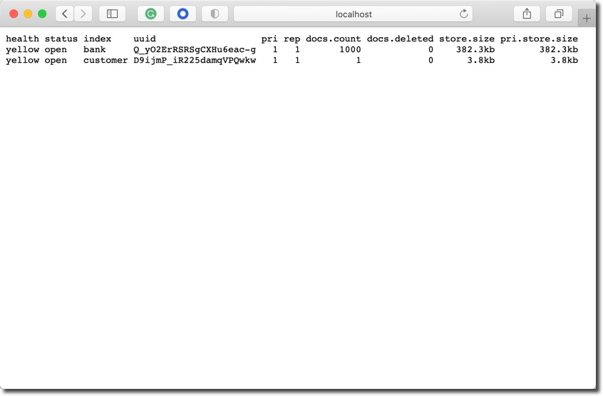
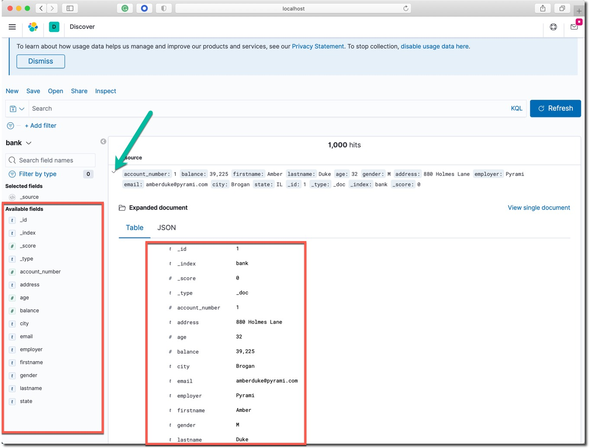

summary: 搭建单节点 Elasticsearch 集群服务
id: one-nodes-es-server
categories: elasticsearch
tags: elasticstack
status: Published 
authors: Martin Liu
Feedback Link: https://martinliu.cn
Analytics Account: UA-159133967-1


# 搭建单节点 Elasticsearch 集群服务
<!-- ------------------------ -->
## 概述
Duration: 1

### 学习收益

你将学习到以下技能：

1. 下载并运行 Elasticsearch 服务器
2. 在服务器中索引一些文档（使用 _index API）
3. 体验搜索查询 （使用 _search API）
4. 尝试数据分析聚合 （使用 _search API）
5. 下载并运行 Kibana 服务器

本课程的所有程序文件、软件包的下载地址如下：

* 国内的YUM源服务器1：https://mirror.tuna.tsinghua.edu.cn/elasticstack/
* 国内的YUM源服务器2：https://mirrors.cloud.tencent.com/elasticstack/
* 国内的YUM源服务器3：https://mirrors.aliyun.com/elasticstack/
* Elastic 标准YUM源：https://artifacts.elastic.co/downloads/elasticsearch/


### 参考信息

Elastic 官方参考文档：

* [Getting started with Elasticsearch](https://www.elastic.co/guide/en/elasticsearch/reference/current/getting-started.html)
* [Discovery and cluster formation settings](https://www.elastic.co/guide/en/elasticsearch/reference/current/modules-discovery-settings.html)
* [Bootstrap Checks](https://www.elastic.co/guide/en/elasticsearch/reference/current/bootstrap-checks.html#single-node-discovery)
* [Search your data](https://www.elastic.co/guide/en/elasticsearch/reference/current/search-your-data.html)
* [Aggregations](https://www.elastic.co/guide/en/elasticsearch/reference/current/search-aggregations.html)

Elastic Stack 包含了我们常说的 ELK 或者 ELKB。如下图所示：


ELK 是 Elasticsearch、Logstash和Kinina的首字母缩写，ELK Stack是elastic公司三大核心产品的组合方案。


## 环境需求检查
Duration: 2

顺利完成本 Lab 的笔记本电脑的软硬件需求如下。

Positive
: 建议使用配置足够的笔记本电脑，在本机的命令行直接运行本 Lab 的相关操作，已获取最佳体验。或者使用一个本地运行的虚拟机，效果更佳。

### 笔记本电脑或者虚拟机硬件配置

* 8GB 内存或更多
* i5 及更高 CPU
* Wifi 或有线网络，能访问互联网。

### 软件配置

* MacOS、Windows 或者 Linux 操作系统都可以。
* 终端命令行工具软件，例如： iTerm2、Terminal、 [cmder for Windows 10](https://cmder.net/)。
* curl、wget 或者其他的图形化下载工具。
* 虚拟机运行软件 Virutalbox 或者 VMWare Workstation。
* 创建一个 Linux 虚拟机，内存不小于 4GB，确保虚拟机关闭防火墙软件，所有端口都可以和本机正常通讯。

Negative
: 打开命令行工具软件，进入一个准备好的空目录。或者SSH登陆准备好的虚拟机。

## 运行 Elasticsearch 服务器
Duration: 5

Positive
: 远程下载安装 Elasticsearch 服务器软件。


使用清华大学的YUM镜像源安装。

```shell
sudo yum install -y https://mirror.tuna.tsinghua.edu.cn/elasticstack/yum/elastic-7.x/7.15.1/elasticsearch-7.15.1-x86_64.rpm
```

在启动 Elasticsearch 服务之前，创建启用安全选项所需的 TLS 数字证书，运行证书创建工具如下所示：

```shell
sudo /usr/share/elasticsearch/bin/elasticsearch-certutil cert -out /etc/elasticsearch/elastic-certificates.p12 -pass ""
sudo chmod 660 /etc/elasticsearch/elastic-certificates.p12
sudo ls -l /etc/elasticsearch/elastic-certificates.p12
```

将 Elasticsearch 默认的配置文件内容更新为如下内容。

```yaml
# ---------------------------------- Cluster -----------------------------------
cluster.name: elk-es01

# ----------------------------------- Paths ------------------------------------
path.data: /var/lib/elasticsearch
path.logs: /var/log/elasticsearch

# ---------------------------------- Network -----------------------------------
network.host: 0.0.0.0

# --------------------------------- Discovery ----------------------------------
discovery.type: single-node

# ------------------------------- TLS and Cert ---------------------------------
xpack.security.enabled: true

xpack.security.transport.ssl.enabled: true
xpack.security.transport.ssl.verification_mode: certificate
xpack.security.transport.ssl.keystore.path: elastic-certificates.p12
xpack.security.transport.ssl.truststore.path: elastic-certificates.p12

# ------------------------------- Security ---------------------------------
xpack.security.authc.api_key.enabled: true
xpack:
  security:
    authc:
      realms:
        native:
          native1:
            order: 0

#  ------------------------------- App Search ---------------------------------
action.auto_create_index: ".app-search-*-logs-*,-.app-search-*,+*"
```

用以上配置内容，创建名为 'sec.yml' 的配置文件，替换默认 'elasticsearch.yml' 配置文件的内容（下面用 cp 命令覆盖默认配置文件的方式更新默认配置文件，后续的所有配置更新都会使用这个方式）。然后启动 Elasticsearch 服务。

```sh
sudo cp sec.yml /etc/elasticsearch/elasticsearch.yml
sudo systemctl daemon-reload
sudo systemctl enable elasticsearch.service
sudo systemctl start elasticsearch.service
sudo systemctl status elasticsearch
```

使用 `sudo tail -f /var/log/elasticsearch/elk-es01.log ` 命令查看当前 Elasticsearch 服务的日志。

初始化 ES 服务器内建用户的密码。

```shell
sudo /usr/share/elasticsearch/bin/elasticsearch-setup-passwords interactive -b
```

将本练习所使用的默认密码  `security123` 复制到剪切板，这条命令的每一个提示符出现的位置，用快捷键粘贴输入这个密码之后，按回车输入该密码，用这个方式给所有系统内置账号设置了相同的密码（纯粹测试目的，并不建议这么做）。以上命令的输出如下：

```shell
Enter password for [elastic]:
Reenter password for [elastic]:
Enter password for [apm_system]:
Reenter password for [apm_system]:
Enter password for [kibana_system]:
Reenter password for [kibana_system]:
Enter password for [logstash_system]:
Reenter password for [logstash_system]:
Enter password for [beats_system]:
Reenter password for [beats_system]:
Enter password for [remote_monitoring_user]:
Reenter password for [remote_monitoring_user]:
Changed password for user [apm_system]
Changed password for user [kibana_system]
Changed password for user [kibana]
Changed password for user [logstash_system]
Changed password for user [beats_system]
Changed password for user [remote_monitoring_user]
Changed password for user [elastic]
```

在浏览器中访问 http://IP-address:9200/ ，测试 Elasticsearch 服务是否正常，确认上面配置的 elastic 用户的密码 `security123` 登录。


ssh 等了到Linux操作系统，在一个新的命令行窗口中用 `curl` 命令行工具测试 Elasticsearch 集群服务的状态。

使用下面的命令查看Elasticsearch服务的基本信息。

`curl --user elastic:security123 -X GET http://localhost:9200`


```bash
{
  "name" : "node1",
  "cluster_name" : "1m-only",
  "cluster_uuid" : "LvHOXakFTby0-uPwq_Ekiw",
  "version" : {
    "number" : "7.9.3",
    "build_flavor" : "default",
    "build_type" : "tar",
    "build_hash" : "c4138e51121ef06a6404866cddc601906fe5c868",
    "build_date" : "2020-10-16T10:36:16.141335Z",
    "build_snapshot" : false,
    "lucene_version" : "8.6.2",
    "minimum_wire_compatibility_version" : "6.8.0",
    "minimum_index_compatibility_version" : "6.0.0-beta1"
  },
  "tagline" : "You Know, for Search"
}

```

查看集群的状态信息。Linux (SSH 登陆之后) 和 macOS:

`curl --user elastic:security123 -X GET http://localhost:9200/_cat/nodes\?v`

应该看到类似于下面的输出。

```bash

ip        heap.percent ram.percent cpu load_1m load_5m load_15m node.role master name
127.0.0.1           17          97   7    2.05                  dilmrt    *      node1
```

上面的 `master` 那一列下面的值为 `*` 号，表明节点 `node1` 是主节点。


在浏览器中验证 Elasticsearch 集群服务的状态，打开浏览器中访问这个网址 `http://IP_ADDRESS:9200` 。或者访问本地虚拟机的 IP 地址，或者云主机的公网IP地址，例如：`http://192.168.50.11:9200` ，访问结果应如下图所示：


然后尝试访问这个网址 `http://IP_address:9200/_cat/nodes\?v` 。

Negative
: 注意：请确保将 Elasticsearch 服务运行正常，可以在网页浏览器中登录/验证 elastic 用户的密码 security123。

## 索引一些文档「可选实践lab」
Duration: 8

Positive
: 这个本地运行的 Elasticsearch 集群提供着功能完整的 RESTFul API 服务，包括对文档的增删改查（CURD）等操作。

### 索引单个和返回单个文档

索引一个文档，该文档只具有一个键值对数据 "name": "John Doe" 。

```bash
curl --user elastic:security123 -X PUT "localhost:9200/customer/_doc/1?pretty" -H 'Content-Type: application/json' -d'
{
  "name": "John Doe"
}
'
```

注意：以上命令最后一行还有一个单引号。

以上命令的返回结果如下：


```
{
  "_index" : "customer",
  "_type" : "_doc",
  "_id" : "1",
  "_version" : 1,
  "result" : "created",
  "_shards" : {
    "total" : 2,
    "successful" : 1,
    "failed" : 0
  },
  "_seq_no" : 0,
  "_primary_term" : 1
}
```

以上的命令创建了名称为 `customer` 的新索引，并保存了第一个编号为 `1` 的文档。 

用下面的命令取回这个编号为 `1` 的文档。

```sh
curl --user elastic:security123  -X GET "localhost:9200/customer/_doc/1?pretty"

```

返回的结果如下：

```
{
  "_index" : "customer",
  "_type" : "_doc",
  "_id" : "1",
  "_version" : 1,
  "_seq_no" : 0,
  "_primary_term" : 1,
  "found" : true,
  "_source" : {
    "name" : "John Doe"
  }
}

```


### 批量索引文档

在有大量文档的时候，可以使用 [buck API](https://www.elastic.co/guide/en/elasticsearch/reference/7.9/docs-bulk.html) 进行批量索引（导入）的操作。

确认软件包目录下有一个名为 `account.json` 的文件。否则根据下面的提示下载该文件。

下载测试数据文件 [accounts.json](https://github.com/elastic/elasticsearch/blob/master/docs/src/test/resources/accounts.json?raw=true) ，这个文件中有一千条人工生成的数据。

<button>
[点此下载 account.json 文件](https://github.com/elastic/elasticsearch/blob/master/docs/src/test/resources/accounts.json?raw=true)
</button>

或者在Linux 的操作系统中使用命令下载该文件。

curl -O https://github.com/elastic/elasticsearch/blob/master/docs/src/test/resources/accounts.json

将 `account.json` 文件下载到测试目录中，用文本编辑器打开浏览确认，或者在 Linux 系统中执行命令 ` cat account.json`。这个文件中有一千条数据记录。

在命令行中，进入以上测试数据文件的目录中，运行下面的两条命令。

```sh
curl --user elastic:security123 -H "Content-Type: application/json" -XPOST "localhost:9200/bank/_bulk?pretty&refresh" --data-binary "@accounts.json"
curl --user elastic:security123 "localhost:9200/_cat/indices?v"
```

以上命令的结果，最后三行应该如下所示：

```
health status index    uuid                   pri rep docs.count docs.deleted store.size pri.store.size
yellow open   bank     Q_yO2ErRSRSgCXHu6eac-g   1   1       1000            0    382.2kb        382.2kb
yellow open   customer D9ijmP_iR225damqVPQwkw   1   1          1            0      3.8kb          3.8kb
```

上面的结果表明：当前的集群中已经创建了两个索引 `bank` 和 `customer` ; 名为 `bank` 的索引显示文档数为 1000，这就是刚才用 bulk API 导入的数据。

如果在浏览器中访问这个网址 http://IP_ADDRESS:9200/_cat/indices?v 也可以看到如下相同结果。



Negative
: `_doc` 和 `_bulk` API 索引了单个和批量的数据文档。名为 `bank` 和 `customer` 的索引也在过程中被创建。

## 测试搜索功能「可选实践lab」
Duration: 6

Positive
: 使用 _search API 进行搜索，Elasticsearch [Query DSL](https://www.elastic.co/guide/en/elasticsearch/reference/current/query-dsl.html) 有一整套的搜索能力。


### 搜索 1 

说明：

* 目标 bank 索引
* 搜索所有文档
* 结果按 account_number 字段升序排列

在命令行执行下面的命令。

```sh
curl --user elastic:security123 -X GET "localhost:9200/bank/_search?pretty" -H 'Content-Type: application/json' -d'
{
  "query": { "match_all": {} },
  "sort": [
    { "account_number": "asc" }
  ]
}
'
```

执行结果解释：

* took – Elasticsearch 执行本次查询使用了多少毫秒
* timed_out – 是否查询超时
* _shards – 有多少个数据分片参与了本次搜索，按成功、略过和失败计数
* max_score – 找到的最相关文档的相关度分数
* hits.total.value - 找到了多少个相关文档
* hits.sort - 文档排序字段位置(在没有设置的时候用相关度分数排序)
* hits._score 文档的相关度分数（在 match_all 时不适用）

以上命令返回了搜索结果的整体概述信息和第一页（前 10 条文档）的搜索结果。


-------


### 搜索 2 

说明：

* 目标 bank 索引
* 搜索所有文档
* 从返回结果中取出第 10 到 19 个文档。
    * from 结果的起始位置
    * size 返回的数据条数

在命令行执行下面的命令。

```sh
curl --user elastic:security123 -X GET "localhost:9200/bank/_search?pretty" -H 'Content-Type: application/json' -d'
{
  "query": { "match_all": {} },
  "sort": [
    { "account_number": "asc" }
  ],
  "from": 10,
  "size": 10
}
'
```

执行结果解释：

* 在 1000 个文档中成功的搜索到 10 个文档
* 返回结果中 _id 从 10 滚动到 19
* 工返回 10 个文档


-------


### 搜索 3 

说明：

* 目标 bank 索引
* 搜索所有地址中还有 `mill` 和 `lane` 关键词的文档


在命令行执行下面的命令。

```sh
curl --user elastic:security123 -X GET "localhost:9200/bank/_search?pretty" -H 'Content-Type: application/json' -d'
{
  "query": { "match": { "address": "mill lane" } }
}
'

```
执行结果解释：

* 在 1000 个文档中成功的搜索到 19 个文档
* 返回结果中观察 `address` 这个字段的返回值
* 默认只显示前 10 条数据
* 文档相关性最高分是 9.507477
* 相关性最高的文档，address 字段中同时包含了  `mill` 和 `lane` 两个关键词。


-------


###搜索 4 


说明：

* 目标 bank 索引
* 搜索所有年龄为 40 且不居住在 ‘ID’ 州的账号。


在命令行执行下面的命令。

```sh
curl --user elastic:security123  -X GET "localhost:9200/bank/_search?pretty" -H 'Content-Type: application/json' -d'
{
  "query": {
    "bool": {
      "must": [
        { "match": { "age": "40" } }
      ],
      "must_not": [
        { "match": { "state": "ID" } }
      ]
    }
  }
}
'
```

执行结果解释：

* 在 1000 个文档中成功的搜索到 43 个文档
* 返回结果中观察 `age` 这个字段的都是 `40`
* 返回结果中观察 `state` 这个字段的值都不是 `ID`


-------

### 搜索 5 

说明：

* 目标 bank 索引
* 搜索所有账号
* 返回账户余额金额 `balance` 在 20000 到 30000 之间的数据


在命令行执行下面的命令。


```sh
curl --user elastic:security123 -X GET "localhost:9200/bank/_search?pretty" -H 'Content-Type: application/json' -d'
{
  "query": {
    "bool": {
      "must": { "match_all": {} },
      "filter": {
        "range": {
          "balance": {
            "gte": 20000,
            "lte": 30000
          }
        }
      }
    }
  }
}
'
```


执行结果解释：

* 在 1000 个文档中成功的搜索到 217 个文档
* 在返回结果中观察 `balance`  的数值是否满足搜索条件

Negative
: 通过 `_search` API 成功的完成了 5 个目的不同的搜索操作，体会 Elasticsearch 的搜索能力。

## 搜索结果的聚合分析「可选实践lab」
Duration: 6

Positive
: Elasticsearch 可以在搜索结果中进行聚合分析  [Aggregations](https://www.elastic.co/guide/en/elasticsearch/reference/current/search-aggregations.html) ，通过各种结构汇计算总搜索结果数据。


### 聚合运算 1

说明：

* 不是设置任何搜索条件，在所有文档中做聚合运算
* 不返回任何文档 size = 0
* 用 state 作为关键字分组查询结果


在命令行执行下面的命令。


```sh
curl --user elastic:security123 -X GET "localhost:9200/bank/_search?pretty" -H 'Content-Type: application/json' -d'
{
  "size": 0,
  "aggs": {
    "group_by_state": {
      "terms": {
        "field": "state.keyword"
      }
    }
  }
}
'
```


执行结果解释：

* hits 总共搜索了 1000 个文档
* 在 aggregations 查看每个州的银行账户总个数


### 聚合运算 2

说明：

* 不是设置任何搜索条件，在所有文档中做聚合运算
* 不返回任何文档 size = 0
* 用 state 作为关键字分组查询结果
* 计算每个州银行账户里的余额的平均值 
* 默认以每个州的账户数量排序结果


在命令行执行下面的命令。


```sh
curl --user elastic:security123 -X GET "localhost:9200/bank/_search?pretty" -H 'Content-Type: application/json' -d'
{
  "size": 0,
  "aggs": {
    "group_by_state": {
      "terms": {
        "field": "state.keyword"
      },
      "aggs": {
        "average_balance": {
          "avg": {
            "field": "balance"
          }
        }
      }
    }
  }
}
'
```


执行结果解释：

* 结果同上一个聚合
* 另外增加了每个州的所有银行账户的余额求平均值运算

###聚合运算 3

说明：

* 其它功能同上
* 用每个州的平均账户余额从大到小排序结果


在命令行执行下面的命令。


```sh
curl --user elastic:security123 -X GET "localhost:9200/bank/_search?pretty" -H 'Content-Type: application/json' -d'
{
  "size": 0,
  "aggs": {
    "group_by_state": {
      "terms": {
        "field": "state.keyword",
        "order": {
          "average_balance": "desc"
        }
      },
      "aggs": {
        "average_balance": {
          "avg": {
            "field": "balance"
          }
        }
      }
    }
  }
}
'
```


执行结果解释：

* 观察 bucket 里的聚合结果
* 按每个州的所有银行账户的平均值倒排序

Negative
:  通过 `_search` API 中的 `aggs` 运算成功的完成了 3 个目的不同的搜索结果聚合运算操作，体会 Elasticsearch 的数据搜索后的聚合运算分析能力。

## 运行和使用 Kibana 服务器
Duration: 8


执行 Kibana 安装命令，如下所示：

```shell
sudo yum install -y https://mirror.tuna.tsinghua.edu.cn/elasticstack/yum/elastic-7.x/7.15.0/kibana-7.15.0-x86_64.rpm
```

准备预配置的 Kibana 的配置文件，如下：

```yaml
server.host: "0.0.0.0"
elasticsearch.hosts: ["http://localhost:9200"]
elasticsearch.username: "kibana_system"
elasticsearch.password: security123
enterpriseSearch.host: 'http://localhost:3002'
i18n.locale: zh-CN
xpack.security.enabled: true
xpack.security.encryptionKey: "fhjskloppd678ehkdfdlliverpoolfcr"
xpack.encryptedSavedObjects.encryptionKey: "Si0gjCjujZ0LghDiApKJfGhGeVJ8JwxrY1z7rOpBva"
```

上见示例配置文件 kb.yml。如果你使用的其它自定义的 IP 地址，请注意在后续的所有操作中替换它。

更新默认配置文件，用以上示例配置文件覆盖 Kibana 默认配置文件，然后启动 Kibana 服务。

```shell
cp /etc/kibana/kibana.yml /etc/kibana/kibana.yml.bk
cp kb.yml /etc/kibana/kibana.yml 
systemctl start  kibana.service 
systemctl status   kibana.service
```

查看 Kibana 服务的日志是否正常。

```shell
sudo tail -f /var/log/messages
```

在浏览器里测试登录 Kibana 的IP地址  http://192.168.50.11:5601 ，使用 elastic 用户名和密码 security123。点击主页上的“安全”的链接，你应该看到如下的界面。


### 启用企业版许可 30 天试用

点击 Kibana 左上角菜单中点击 “Stack Management” --> “许可管理”，点击 “开始试用” 按钮，启用 30 天的高级功能的试用期。

Negative
: 注意：至此完成了 Elastic Stack 的基础准备工作，Elasticsearch + Kibana 的服务都处于正常运行状态，启用了企业版功能的试用。


### 登录 Kibana 控制台导入&查看示例数据

到目前为止，Elasticsearch 集群运行在无密码的开发模式，因此无需输入用户名和密码。

打开浏览器访问网址 `localhost:5601` 或者虚拟机的 IP 地址，例如  `192.168.50.11:5601`； 登陆后点击“添加数据”按钮。然后点击页面中的“样例数据”标签页，进入样例数据导入界面。


分别点击这三个按钮「添加数据」，导入三组示例数据。


点击 Dashboard 查看数据分析仪表板。


### 创建 bank 索引模式&查看数据

为了在图形界面中创建用于分析 bank 索引中所有数据的"索引模式"。


点击左上角的按钮打开左侧菜单，点击 Stack Management 菜单。


在 Kibana 管理选项中，点击创建【索引模式】按钮。


在索引模式名称中输入 bank ， 点击先一步直到创建完成。


点击左上角的按钮，打开左侧菜单栏，点击 Kibana 部分的 Discover 链接。


点击左侧的向下三角图标，打开索引选择菜单，选中刚才创建的 bank 索引模式。



参考左侧的可用字段，这是 bank 索引的所有字段。点击第一条数据的向下按钮，查看该文档。

Negative
: 成功的导入和查看了 Kibana 产品附带的三组示例数据。使用 Kibana 图形界面探索了批量导入的 bank 索引中的数据。

