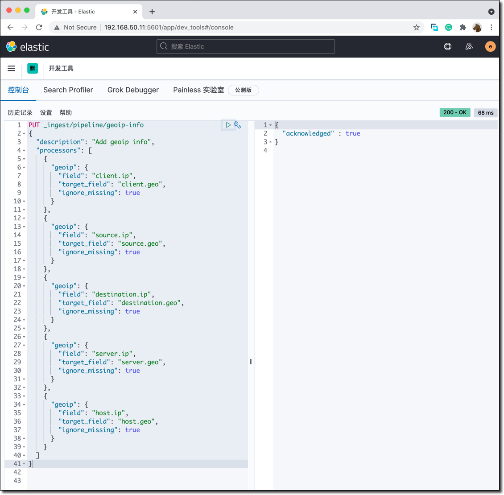
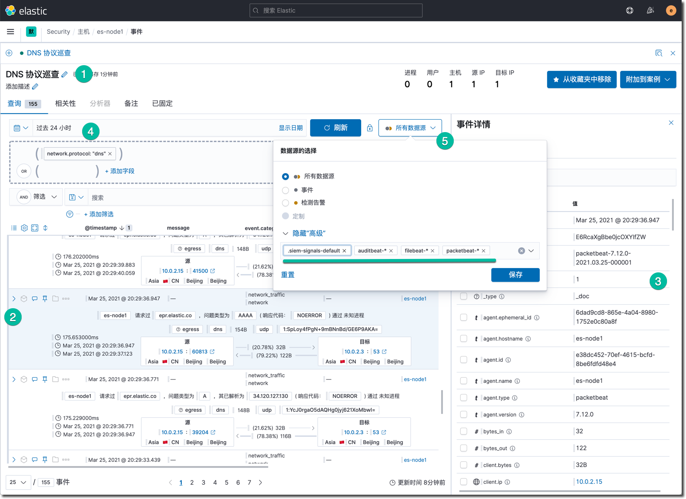
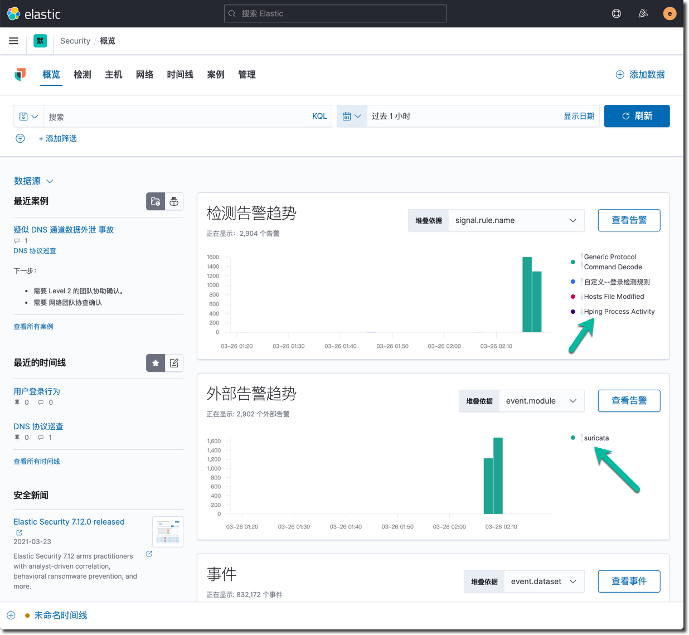
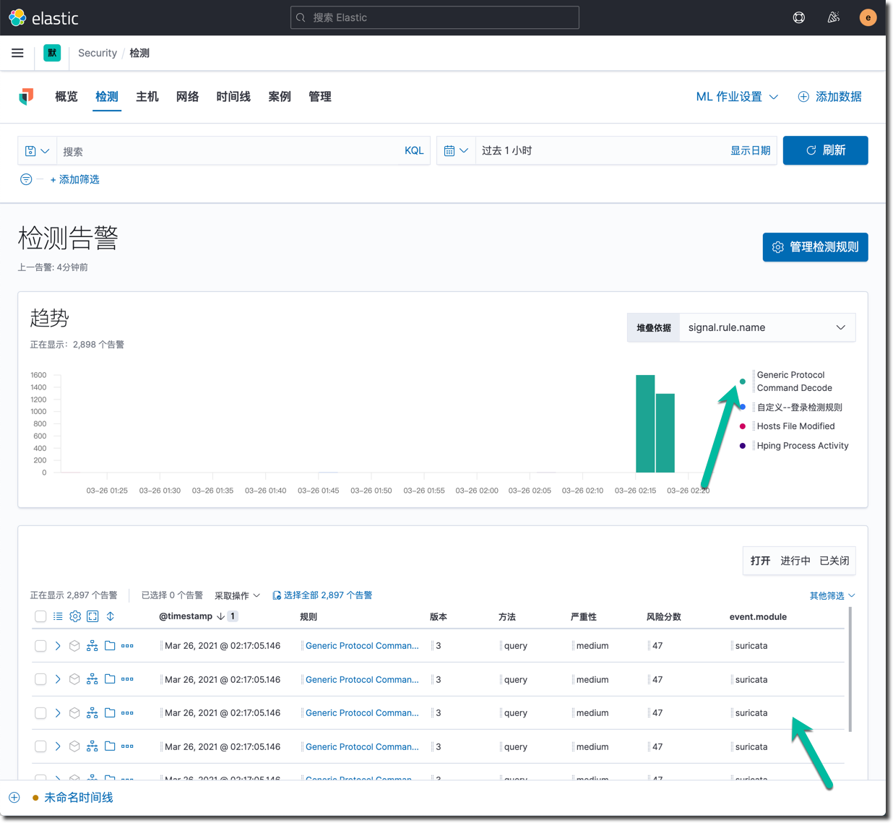

 

summary: Elastic 安全实战工作坊(中等)
id: elastic-security-foundation
categories: elasticsearch, beats, kibana, security
tags: elasticstack
status: Published 
authors: Martin Liu
Feedback Link: https://martinliu.cn
Analytics Account: UA-159133967-1


# Elastic 安全实战工作坊(中等)
<!-- ------------------------ -->

## 概述 
Duration: 5


用 Elastic Security 来武装每一位安全运维人员，从容的预防、检测和应对网络威胁。这款免费开放的解决方案提供了 SIEM、端点安全、威胁狩猎、云监控、恶意软件保护等功能。在这个课程中，您将学习如何利用 Elastic Security 的 SIEM 功能和威胁检测功能来为您的安全运维保驾护航。

本课程专为安全分析师（SecOps），和其它对此感兴趣工程师而设计。希望你在本课程中体验到运用 Elastic Security 进行安全运维的一天。你将学习到如何使用 Elastic Security 来可视化数据，配置数据摄入，应用规则检测引擎。在本课程结束时，你将全面掌握使用 Elastic Security 来检测基础设施威胁的工作方法，能够运用 Elasticsearch 的快速搜索进行实时的安全防护和响应。


在本课程中您将会学到：

1. 在单节点 Linux 服务器上搭建 Elasticsearch + Kibana 服务。
2. 学习使用 Elastic Stack 进行安全管理的基本概念和方案架构。
3. 使用 Elastic 提供的 Auditbeat、 Filebeat 和 PacketBeat 摄入数据。
4. 部署和接入外部开源 IDS 软件 Scatea 的监控数据
5. 学习使用 Elastic Security 提供的时间线事件分析工具
6. 启用和配置内置的安全监测规则，实施 MITRE ATT&CK 安全威胁狩猎
7. 应用机器学习的异常监测能力自动化和增强安全巡检


### Elastic Security 安全方案架构


本课程所使用到的 Elastic Stack 的组件包括：

* Elasticsearch、Kibana、Packetbeat、Filebeat、Auditbeat 版本是 7.11. 2。

* Suricata 版本 5.0.6，开源入侵监测引擎。


### 安全管理旅程的四个阶段

网络信息安全管理方案的复杂性和成本是有目共睹的，通常安全相关工作由安全管理团队专人专职负责，他们运用各种专业技能和工具开展日常的工作。Elasticsearch 在安全领域是经常被使用到的搜索和分析平台。Elastic 在最近几年着重发展了对安全管理的支持。用户可以在已有的 Elastic Stack 的技能的基础上，平滑的扩展到安全管理使用场景，复用现有的技能和 ELK 基础设施解决安全管理的痛点。


分阶段的开展安全管理的推荐过程如下：

1. STEP1：使用 Beats  按需收集各种安全事件
2. STEP2：使用 SIEM 功能开展 SOC 日常安全运维工作，Kibana 作为统一的搜索分析工具 
3. STEP3：基于内置的安全监测规则，自动化威胁检测和告警机制
4. STEP4：与外部安全管理工具系统集成，完成无盲区的安全事故检测响应全工作流程


## 系统准备

Duration: 15

本培训的所有操作和配置都从在一个虚拟机上完成。需要启动一个 CentOS 8 Linux 虚拟机，需求如下：

* 内存建议至少 4GB，推荐 6GB。
* 磁盘10GB 以上。
* 有顺畅的互联网连接，在练习的过程中需要从互联网下载软件包。
* 虚拟机软件不限，VMWare，Virtualbox 或者是云主机都可以。

下面是一个示例的 Virtualbox 的配置文件。请注意：如果你不是使用的这个 IP 地址，在后续的练习中，你需要用你实际的虚拟机 IP 替换 "192.168.50.11"，后续任何"192.168.50.11"出现的地方，都需要替换成你的实际 IP。

```ruby
# -*- mode: ruby -*-
# vi: set ft=ruby :

# Every Vagrant development environment requires a box. You can search for
# boxes at https://atlas.hashicorp.com/search.
BOX_IMAGE = "bento/centos-8"
Vagrant.configure("2") do |config|

# 用于部署 Elasticsearch 服务器的集群
    config.vm.define :es01 do |es_config|
      es_config.vm.box = BOX_IMAGE
      es_config.vm.hostname = "es-node1"
      es_config.vm.network :private_network, ip: "192.168.50.11"
      es_config.vm.provider :virtualbox do |vb|
        vb.memory = 6000
        vb.cpus = 2
      end
    end
end
```

本课程使用的 Elastic Stack 安装包，示例配置文件都可以在下列位置获取。

Elastic Stack 软件安装包清单：

* auditbeat-7.12.0-x86_64.rpm
* filebeat-7.12.0-x86_64.rpm
* packetbeat-7.12.0-x86_64.rpm
* elasticsearch-7.12.0-x86_64.rpm
* kibana-7.12.0-x86_64.rpm

你可以在 Elastic 官网下载，也可以在这个百度网盘下载（示例配置文件）：链接: https://pan.baidu.com/s/180iRADaE1kdqPptPokdSoQ  密码: 82ui

###安装配置 Elasticsearch

首先，开始安装和配置 Elasticsearch 服务，假设后续步骤的所有安装包和示例配置文件都位于 `/vagrant` 目录下，你的 rpm 软件包和配置文件也可以位于其它路径中（如果你用的不是 Vagrant 虚拟机的话，也建议将 5 个 rpm 安装包和 5 个示例配置文件都放到这个路径中，后续的课程中只需要复制粘贴命令即可，这样就方便很多），执行安装命令如下：

```shell
cd /vagrant/rpm
sudo rpm -ivh  elasticsearch-7.12.0-x86_64.rpm
```

在启动 Elasticsearch 服务之前，创建启用安全选项所需的 TLS 数字证书，运行证书创建工具如下所示：

```shell
sudo /usr/share/elasticsearch/bin/elasticsearch-certutil cert -out /etc/elasticsearch/elastic-certificates.p12 -pass ""
sudo chmod 660 /etc/elasticsearch/elastic-certificates.p12
sudo ls -l /etc/elasticsearch/elastic-certificates.p12
```

将 Elasticsearch 默认的配置文件内容更新为如下内容。

```yaml
# ---------------------------------- Cluster -----------------------------------
cluster.name: elk-es01

# ----------------------------------- Paths ------------------------------------
path.data: /var/lib/elasticsearch
path.logs: /var/log/elasticsearch

# ---------------------------------- Network -----------------------------------
network.host: 0.0.0.0

# --------------------------------- Discovery ----------------------------------
discovery.type: single-node

# ------------------------------- TLS and Cert ---------------------------------
xpack.security.enabled: true

xpack.security.transport.ssl.enabled: true
xpack.security.transport.ssl.verification_mode: certificate
xpack.security.transport.ssl.keystore.path: elastic-certificates.p12
xpack.security.transport.ssl.truststore.path: elastic-certificates.p12

# ------------------------------- Security ---------------------------------
xpack.security.authc.api_key.enabled: true
```

见示例配置文件 sec-2.yml，用以上内容替换默认 elasticsearch.yml 文件的内容（下面用 cp 命令覆盖默认配置文件的方式更新默认配置文件，后续的所有配置更新都会使用这个方式）。然后启动 Elasticsearch 服务。

```sh
sudo cp /vagrant/sec-2.yml /etc/elasticsearch/elasticsearch.yml
sudo systemctl daemon-reload
sudo systemctl enable elasticsearch.service
sudo systemctl start elasticsearch.service
sudo systemctl status elasticsearch
```

使用 `sudo tail -f /var/log/elasticsearch/elk-es01.log ` 命令查看当前 Elasticsearch 服务的日志。

初始化 ES 服务器内建用户的密码。

```shell
sudo /usr/share/elasticsearch/bin/elasticsearch-setup-passwords interactive -b
```

将本练习所使用的默认密码  `security123` 复制到剪切板，这条命令的每一个提示符出现的位置，用快捷键粘贴输入这个密码之后，按回车输入该密码，用这个方式给所有系统内置账号设置了相同的密码（纯粹测试目的，并不建议这么做）。以上命令的输出如下：

```shell
Enter password for [elastic]:
Reenter password for [elastic]:
Enter password for [apm_system]:
Reenter password for [apm_system]:
Enter password for [kibana_system]:
Reenter password for [kibana_system]:
Enter password for [logstash_system]:
Reenter password for [logstash_system]:
Enter password for [beats_system]:
Reenter password for [beats_system]:
Enter password for [remote_monitoring_user]:
Reenter password for [remote_monitoring_user]:
Changed password for user [apm_system]
Changed password for user [kibana_system]
Changed password for user [kibana]
Changed password for user [logstash_system]
Changed password for user [beats_system]
Changed password for user [remote_monitoring_user]
Changed password for user [elastic]
```

在浏览器中访问http://192.168.50.11:9200/ ，测试 Elasticsearch 服务是否正常，确认上面配置的 elastic 用户的密码 `security123` 登录。

Negative
: 注意：请确保将 Elasticsearch 服务运行正常，可以在网页浏览器中登录/验证 elastic 用户的密码 security123。

### 安装配置 Kibana

在 rpm 软件安装包的目录中，执行 Kibana 安装命令，如下所示：

```shell
cd /vagrant/rpm/
sudo rpm -ivh  kibana-7.12.0-x86_64.rpm
```

准备预配置的 Kibana 的配置文件，如下：

```yaml
server.host: 192.168.50.11
server.port: 5601
elasticsearch.hosts: ["http://192.168.50.11:9200"]
elasticsearch.username: elastic
elasticsearch.password: security123
i18n.locale: zh-CN
xpack.security.enabled: true
xpack.security.encryptionKey: "fhjskloppd678ehkdfdlliverpoolfcr"
xpack.encryptedSavedObjects.encryptionKey: "Si0gjCjujZ0LghDiApKJfGhGeVJ8JwxrY1z7rOpBva"
xpack.fleet.agents.tlsCheckDisabled: true
```

上见示例配置文件 sec-3.yml。如果你使用的其它自定义的 IP 地址，请注意在后续的所有操作中替换它。

更新默认配置文件，用以上示例配置文件覆盖 Kibana 默认配置文件，然后启动 Kibana 服务。

```shell
sudo cp /vagrant/sec-3.yml /etc/kibana/kibana.yml
sudo systemctl start  kibana.service
sudo systemctl status   kibana.service
```

查看重启的 Kibana 服务是否正常。

```shell
sudo tail -f /var/log/messages
```

在浏览器里测试登录 Kibana 的地址  http://192.168.50.11:5601 ，使用 elastic 用户名和密码 security123。点击主页上的“安全”的链接，你应该看到如下的界面。


####创建 GeoIp 解析流水线

还需要为摄入数据创建一个用于解析 IP 地址地理位置的 pipeline ，这个操作在 Kibana 的开发者工具中完成。将下面的代码复制粘贴到 Kibana 的开发者工具中。

```json
PUT _ingest/pipeline/geoip-info
{
  "description": "Add geoip info",
  "processors": [
    {
      "geoip": {
        "field": "client.ip",
        "target_field": "client.geo",
        "ignore_missing": true
      }
    },
    {
      "geoip": {
        "field": "source.ip",
        "target_field": "source.geo",
        "ignore_missing": true
      }
    },
    {
      "geoip": {
        "field": "destination.ip",
        "target_field": "destination.geo",
        "ignore_missing": true
      }
    },
    {
      "geoip": {
        "field": "server.ip",
        "target_field": "server.geo",
        "ignore_missing": true
      }
    },
    {
      "geoip": {
        "field": "host.ip",
        "target_field": "host.geo",
        "ignore_missing": true
      }
    }
  ]
}

 GET _ingest/pipeline/geoip-info
```

将左侧编辑器文本框中的光标移动到 `PUT _ingest/pipeline/geoip-info` 这一行，点击右侧扳手图标傍边的三角按钮，执行 pipeline 创建操作。



点击 GET _ingest/pipeline/geoip-info 这个语句右侧的三角形，查看刚才创建的流水线的信息。

####启用 ELK 技术栈自监控

点击 Kibana 左上角菜单中点击 “堆栈监控”，启用自监控，结果如下所示。


在以上的监控功能中，特别是 Beats 这一块，能看到各种 Beats 在被监控节点上的部署结果和运行现状，在后续的测试过程中，建议多次访问这个监控页面查看安装配置结果。

####启用企业版许可 30 天试用

点击 Kibana 左上角菜单中点击 “Stack Management” --> “许可管理”，点击 “开始使用” 按钮，启用 30 天的高级功能的试用期。


Negative
: 注意：至此完成了 Elastic Stack 的基础准备工作，Elasticsearch + Kibana 的服务都处于正常运行状态，完成了技术栈的自监控、启用了企业版功能的试用。

## 安全事件收集

Duration: 30

如果使用 Elastic 的 Beats （以及相关模块）采集和摄入安全事件数据，那么所有数据在进入 Elasticsearch 的过程中就完成了和统一通用数据定义 ECS 的适配。相同含义字段在各个不同数据源中的差异性就在这个过程中得到了调和，在 Kibana 分析安全数据的过程中，也是基于数据已经得到了 ECS 的标准化了。

下面分步骤配置三种最常用的 Beats 数据采集工具。

###安装配置 Auditbeat

Auditbeat 支持的操作系统包括：

* Linux（DEB，RPM，tar.gz）
* MacOS
* Windows
* 容器化环境

以 Linux 为例，Auditbeat 能够提供的安全事件如下：

1. 来自 auditd 的内核事件
2. 跟踪关键文件的完整性
3. 操作系统的软件包、登录、进程、网络 socket 和用户相关事件

安装 Auditbeat 软件包，运行下面的命令：

```sh
sudo rpm -ivh /vagrant/rpm/auditbeat-7.12.0-x86_64.rpm
```

初始化 auditbeat 的索引和数据分析仪表板，运行下面的命令：

```sh
sudo auditbeat setup -e \
  -E output.logstash.enabled=false \
  -E output.elasticsearch.hosts=['192.168.50.11:9200'] \
  -E output.elasticsearch.username=elastic \
  -E output.elasticsearch.password=security123\
  -E setup.kibana.host=http://192.168.50.11:5601
```

待以上文件执行成功以后，在 Kibana 中浏览 Auditbeat 的仪表板。点击名为 “[Auditbeat System] System Overview ECS”的仪表板。


在每一个 Beat 的 setup 命令成功执行完毕之后，都可以在 Kibana 的 Dashboard 菜单查看新增的仪表板。

浏览和理解下面的 Auditbeat 示例文件。

```yaml
auditbeat.modules:
- module: auditd
  audit_rule_files: [ '${path.config}/audit.rules.d/*.conf' ]
  audit_rules: |
- module: file_integrity
  paths:
  - /bin
  - /usr/bin
  - /sbin
  - /usr/sbin
  - /etc
- module: system
  datasets:
    - package # Installed, updated, and removed packages
      period: 2m # The frequency at which the datasets check for changes
- module: system
  datasets:
    - host    # General host information, e.g. uptime, IPs
    - login   # User logins, logouts, and system boots.
    - process # Started and stopped processes
    - socket  # Opened and closed sockets
    - user    # User information
      user.detect_password_changes: true
      login.wtmp_file_pattern: /var/log/wtmp*
      login.btmp_file_pattern: /var/log/btmp*

tags: ["service-siem", "vagrant-vm"]
fields:
  env: workshop

output.elasticsearch:
  hosts: ["192.168.50.11:9200"]
  username: elastic
  password:  security123
  pipeline:  geoip-info

processors:
  - add_host_metadata:
    netinfo.enabled: false
    geo:
      location: 35.5528, 116.2360
      continent_name: Asia
      country_iso_code: CN
      region_name: Beijing
      region_iso_code: CN-BJ
      city_name: Beijing
      name: myCyberSecLab
  - add_locale: ~
  - add_fields:
    when.network.source.ip: private
    fields:
      source.geo.location:
        lat: 35.5528
        lon: 116.2360
      source.geo.continent_name: Asia
      source.geo.country_iso_code: CN
      source.geo.region_name: Beijing
      source.geo.region_iso_code: CN-BJ
      source.geo.city_name: Beijing
      source.geo.name: myCyberSecLab
    target: ''
  - add_fields:
    when.network.destination.ip: private
    fields:
      destination.geo.location:
        lat: 35.5528
        lon: 116.2360
      destination.geo.continent_name: Asia
      destination.geo.country_iso_code: CN
      destination.geo.region_name: Beijing
      destination.geo.region_iso_code: CN-BJ
      destination.geo.city_name: Beijing
      destination.geo.name: myCyberSecLab
    target: ''

setup.ilm.check_exists: false
logging.level: error
queue.spool: ~
monitoring.enabled: true
```

以上配置文件中只包含必要和推荐的一些配置内容，可以作为一个生产环境实施的基础，将其版本化，逐渐修订为你需要的状态，并让它可以被自动化部署工具使用。

运行下面的命令，覆盖默认配置文件，并启动 Auditbeat 服务，开始采集数据。

```sh
sudo cp /vagrant/sec-4.yml /etc/auditbeat/auditbeat.yml
sudo auditbeat test config
sudo auditbeat test output
sudo systemctl start  auditbeat
sudo systemctl status  auditbeat
```

注意：以上的这两条命令  auditbeat **test config** 和  auditbeat **test output** 适用于后续的其它 Beats 的启动前测试。

如果上面的服务启动结果正常，很快的下面可以在 Kibana 的 Discovery 功能中，查看  Auditbeat-* 这个索引的数据。


在 Kibana 的 Dashboard 中查看Auditbeat 的数据分析仪表板 (搜索 system 关键字)。


在 Kibana 的堆栈检测中查看这个 Beat 的运行状态。


Negative
: 注意：至此完成了 Auditbeat 在这个服务器上的部署和配置，并且确认仪表板中的数据都是更新的，这个 Beat采集代理的监控状态也正常。

### 安装配置 Pecketbeat

Pecketbeat 是一个应用监控和性能分析系统，它可以嗅探服务器上发生的网络包，解码 7 层的网络消息，然后将分析结果发送到后台的 Elasticsearch 服务中进行分析， 支持的操作系统包括：

* Linux（DEB，RPM，tar.gz）
* MacOS
* Windows

安装 Pecketbeat 软件包和它的依赖，运行下面的命令：

```sh
sudo yum install libpcap -y
sudo rpm -ivh /vagrant/rpm/packetbeat-7.12.0-x86_64.rpm
```

初始化 Pecketbeat 的索引和数据分析仪表板，运行下面的命令：

```sh
sudo packetbeat setup -e \
  -E output.logstash.enabled=false \
  -E output.elasticsearch.hosts=['192.168.50.11:9200'] \
  -E output.elasticsearch.username=elastic \
  -E output.elasticsearch.password=security123\
  -E setup.kibana.host=http://192.168.50.11:5601
```

以上命令成功执行之后，查看新增的 Packetbeat 仪表板。

查看和学习 Packetbeat 默认的配置文件和下面的示例配置文件的差异。

```yaml
#=== Packetbeat specific options ===
packetbeat.interfaces.device: any
#=== Flows ===
packetbeat.flows:
  timeout: 30s
  period: 10s
#=== Transaction protocols ===
packetbeat.protocols:
- type: icmp
  enabled: true
- type: dhcpv4
  ports: [67, 68]
  send_request: true
  send_response: true
- type: dns
  ports: [53]
  include_authorities: true
  include_additionals: true
  send_request: true
  send_response: true
- type: http
  ports: [80, 8080, 8000, 5000, 8002]
- type: tls
  ports:
    - 443   # HTTPS
    - 993   # IMAPS
    - 995   # POP3S
    - 5223  # XMPP over SSL
    - 8443
    - 8883  # Secure MQTT
    - 9243  # Elasticsearch

tags: ["service-siem", "vagrant-vm"]
fields:
  env: workshop

output.elasticsearch:
  hosts: ["192.168.50.11:9200"]
  username: elastic
  password:  security123
  pipeline:  geoip-info

processors:
  - add_host_metadata:
      netinfo.enabled: false
      geo:
        location: 35.5528, 116.2360
        continent_name: Asia
        country_iso_code: CN
        region_name: Beijing
        region_iso_code: CN-BJ
        city_name: Beijing
        name: myCyberSecLab
  - add_locale: ~
  - detect_mime_type:
      field: http.request.body.content
      target: http.request.mime_type
  - detect_mime_type:
      field: http.response.body.content
      target: http.response.mime_type
  - add_fields:
      when.network.source.ip: private
      fields:
        source.geo.location:
          lat: 35.5528
          lon: 116.2360
        source.geo.continent_name: Asia
        source.geo.country_iso_code: CN
        source.geo.region_name: Beijing
        source.geo.region_iso_code: CN-BJ
        source.geo.city_name: Beijing
        source.geo.name: myCyberSecLab
      target: ''
  - add_fields:
      when.network.destination.ip: private
      fields:
        destination.geo.location:
          lat: 35.5528
          lon: 116.2360
        destination.geo.continent_name: Asia
        destination.geo.country_iso_code: CN
        destination.geo.region_name: Beijing
        destination.geo.region_iso_code: CN-BJ
        destination.geo.city_name: Beijing
        destination.geo.name: myCyberSecLab
      target: ''

setup.ilm.check_exists: false
logging.level: error
queue.spool: ~
monitoring.enabled: true
```

用下面的命令替换默认的位置文件为以上内容，并测试配置文件的语法和功能是否正常，最后启动 Packetbeat 开始采集该服务器上看到的流量。

```sh
sudo cp /vagrant/sec-5.yml /etc/packetbeat/packetbeat.yml
sudo packetbeat test config
sudo packetbeat test output
sudo systemctl start  packetbeat 
sudo systemctl status  packetbeat 
```

尝试用 ping 命令测试几个网站，产生一些网络流量，或者做一次  yum update ，命令如下：

```sh
ping baidu.com
ping www.goo.ne.jp
sudo yum update -y
```

在 Kibana 的主页上点击 “安全”，在这里将看到 Packetbeat 和 Auditbeat 的安全事件统计图。


在 Kibana 的安全应用中，点击网络视图，将看到如下所示：


将鼠标移动到日本的那个红点上，显示详细信息。

Negative
: 注意：至此完成了 Packetbeat 的配置和调试工作，还可以再次确认相关仪表板和 Beat 代理监控的状态。

### 安装配置 Filebeat

在 Kibana 的主页上点击“添加数据”按钮后，点击 “安全”，这里展示的是 Elastic 官方支持的安全事件数据采集模块，大部分是通过 Filebeat 日志文件集成的方式完成。


用户还可以使用 Filebeat 的扩展能力，基于 ECS 开发自己的自定义功能模块，用于安全数据的统一收集，这有利于消除安全信息数据在工具集方面的各种壁垒，消除数据孤岛和死角。

运行下面的命令安装 Filebeat 软件包：

```sh
sudo rpm -ivh /vagrant/rpm/filebeat-7.12.0-x86_64.rpm
```

初始化 Filebeat 的索引和数据分析仪表板，运行下面的命令：

```sh
sudo filebeat setup -e \
  -E output.logstash.enabled=false \
  -E output.elasticsearch.hosts=['192.168.50.11:9200'] \
  -E output.elasticsearch.username=elastic \
  -E output.elasticsearch.password=security123\
  -E setup.kibana.host=http://192.168.50.11:5601
```

Filebeat 默认不会启用任何数据采集模块，运行下面的命令，启用系统日志文件的采集。

```sh
sudo filebeat modules enable system
sudo filebeat modules list
```

Filebeat 的示例文件如下：

```yaml
#=========================== Filebeat inputs =============================
filebeat.inputs:
- type: log
  enabled: false
  paths:
    - /var/log/*.log
#============================ Filebeat modules ============================
filebeat.config.modules:
  path: ${path.config}/modules.d/*.yml
  reload.enabled: true
  reload.period: 60s

tags: ["service-siem", "vagrant-vm"]
fields:
  env: workshop

output.elasticsearch:
  hosts: ["192.168.50.11:9200"]
  username: elastic
  password:  security123
  pipeline:  geoip-info

processors:
  - add_host_metadata:
      netinfo.enabled: false
      geo:
        location: 35.5528, 116.2360
        continent_name: Asia
        country_iso_code: CN
        region_name: Beijing
        region_iso_code: CN-BJ
        city_name: Beijing
        name: myCyberSecLab
  - add_locale: ~
  - add_fields:
      when.network.source.ip: private
      fields:
        source.geo.location:
          lat: 35.5528
          lon: 116.2360
        source.geo.continent_name: Asia
        source.geo.country_iso_code: CN
        source.geo.region_name: Beijing
        source.geo.region_iso_code: CN-BJ
        source.geo.city_name: Beijing
        source.geo.name: myCyberSecLab
      target: ''
  - add_fields:
      when.network.destination.ip: private
      fields:
        destination.geo.location:
          lat: 35.5528
          lon: 116.2360
        destination.geo.continent_name: Asia
        destination.geo.country_iso_code: CN
        destination.geo.region_name: Beijing
        destination.geo.region_iso_code: CN-BJ
        destination.geo.city_name: Beijing
        destination.geo.name: myCyberSecLab
      target: ''

setup.ilm.check_exists: false
logging.level: error
queue.spool: ~
monitoring.enabled: true
```

用下面的命令更新 Filebeat 默认的配置文件，测试文件的可用性，并启动服务。

```sh
sudo cp /vagrant/sec-6.yml /etc/filebeat/filebeat.yml
sudo filebeat test config
sudo filebeat test output
sudo systemctl start  filebeat
sudo systemctl status   filebeat
```

Filebeat 正常运行了几分钟之后，回到 Kibana 中安全应用的主页，在主机事件区域中，可以看到 Filebeat 上传的事件数量。查看 Filebeat 的系统概况仪表板【[Filebeat System] Syslog dashboard ECS】，如下所示：


点击上图的 sudo commands， SSH logins 和 New users 等标签页，查看系统日志的详细分析图。

Negative
: 注意：至此完成了 所有 Elastic 提供的安全事件采集和分析工具体系的搭建。

## SecOps巡检和分析

Duration: 15

在 Elasticsearch 的数据平台里，除了使用各种 Beats 以及相关模块之外，还可以使用 Logstash 集成外部的数据源，外部的系统也可以直接调用 Elasticsearch 的 API 摄入外部数据（基于 ECS）。Elasticsearch 的准实时搜索能力可以让安全运维人员在海量的安全事件数据中作出及时精确的搜索，完成必要的安全巡检和事件精细分析的工作。

#### 基于 KQL 的 DNS 可疑事件分析

在 Kibana 中进入 “安全” 应用的主页，点击 “时间线” 标签页，点击 “创建新时间线” 按钮。创建一个下图所示事件搜索场景。



关键操作说明：

1. 输入 “DNS 协议巡查” 作为时间线名称，然后点击屏幕重要的 “+ 添加字段”链接，输入 "network.protocol dns"，点确定之后，既可以看到下方的事件查询清单。
2. 选中其中一条感兴趣的事件，点击该事件左上角的 “>” 展开详情图标。鼠标悬停在某个域名上，点击快捷工具条中的柱状图按钮，查看域名解析排名统计，分析可疑域名。
3. 在屏幕的右侧既可以看到这条事件的所有非空的详情字段信息。
4. 在上方的日历图标菜单哪里，可以选择查询的时间窗口。
5. 点击 “所有数据源” 按钮，点击 “显示高级” 链接，这里默认全选所有可用数据源索引，可以根据需求进行取舍。
6. 点击屏幕右上角的“添加到收藏夹”按钮，可以将这个时间线分析查询条件，放到 “安全” 应用的首页，作为快捷入口。

这样就定义了一个典型的可以重复使用的搜索分析场景，这个时间线也可以逐渐迭代和进化它的搜索条件，调整输出的字段，从而调整它的精度和用途。

#### 创建安全事故分析案例

当某个时间线的分析结果被判定为安全事故之后，就需要根据它来创建一个故障调查案例，这是 SIEM 的常用场景。点击时间线右上角的 “附加到案例”，选择 “附加到新案例” 选项，进入新建案例界面，如下图所示：


Elastic Security 也是一个团队协作平台，这个开放式协作平台，将数据的搜索服务提供给了所有相关团队，让团队可以第一时间的分析相同的安全事故线索，并在案例中协同工作。

1. 输入案例名称：疑似 DNS 通道数据外泄 事故
2. 设置标签：dns 数据泄露 中
3. 填写描述，这里支持 markdown 格式，支持其它时间线的插入。
4. 在外部连接器字段处选择是否将该安全事故调查上报至企业的安全事故响应平台（目前支持的平台有：IBM Resilient, Jira, ServiceNow ITSM，ServiceNow SecOps），此处什么也不选。
5. 点击页面右下角的确认按钮，创建这个案例。
6. 在案例页面上查看该新建案例，添加后续的调查分析注释，点击 “进行中” 按钮。
7. 查看当前案例的状态，在事故调查完毕后，可以点击“关闭案例”按钮。


#### 基于 EQL 的复杂用户登录分析

本练习旨在帮助你理解 EQL 的分析方法。

在模拟若干次操作系统 SSH 登录的操作，至少包含下面一组事件：

1. vagrant 用户密码输错 1 次
2. vagrant 用户密码输错 2 次
3. vagrant 用户密码输入正确，成功登录

以上操作还可以自由操作若干次，目的在于制造一些ssh 登录事件。

点击 Kibana 菜单中的 “时间线”，点击 “创建新的时间线” 按钮，点击 “相关性”，这里是使用 EQL 事件查询语言的界面。


输入这个事件搜索时间线的相关信息：

1. 时间线名称：用户登录行为
2. 时间周期：选择最近 15 秒
3. 输入下方这段查询语句

```sql
sequence by host.name, source.ip, user.name  with maxspan=15s
[authentication where event.outcome == "failure"]
[authentication where event.outcome == "failure"]
[authentication where event.outcome == "success"]
```

4. 点击刷新按钮查看搜索结果。结果中红色的区域就是匹配出来的三个事件。


可以尝试删除搜索语句中第一行的 “[authentication where event.outcome == "failure"]” 查询条件，看看搜索结果有什么不同。


下面是搜索语法简单解释，详细 EQL 语法[参考件官方文档](https://www.elastic.co/guide/en/elasticsearch/reference/7.12/eql.html)：

* sequence ：匹配按顺序发生的一些事件
* by : 后续出现的所有字段，需要在每一个事件中都包含，且都相同。
* with maxspan : 15s 下面的一些列事件发生的时间窗口是 15 秒。
* authentication ： 事件的类型，其它可能的类型还包括：进程、文件、网络等等。
* event.outcome == "failure" ： 匹配该字段的值为失败的结果。


通过以上的操作，我们可以体会到 EQL 的优势包括：

* EQL 让你表达事件之间的关系：许多查询语言允许您匹配单个事件。EQL可以让您在不同的事件类别和时间跨度上匹配一个事件序列。
* EQL的学习曲线很低：EQL语法看起来像其他常见的查询语言，如SQL。EQL让您直观地编写和读取查询，这使得快速、反复搜索。
* EQL是为安全管理用例设计的：虽然您可以将其用于任何基于事件的数据，但我们创建EQL用于威胁狩猎。EQL不仅支持妥协指标（indicator of compromise  IOC）搜索，而且可以描述超越IOC的活动。

## 安全威胁狩猎

Duration: 10

Elastic Security 7.12增加了检测规则，以发现针对macOS和Linux主机的常见滥用恶意软件和技术，并扩大了针对Windows主机的MITRE ATT&CK®覆盖范围。

Elastic Security 目前内置了 500 多条安全检测规则，这些规则默认没有打开，可以按需打开和关闭每一条检测规则。

#### 启用内置检测规则

1. 在 Kibana 的菜单中，点击 Security 下面的 “检测”
2. 点击 “管理检测规则” 按钮。
3. 点击 “加载 Elastic 预构建规则” 按钮。
4. 很快的，你就可以看到 7.12 版本内置的 546 条规则的，规则清单。
5. 点击标签，输入并选择 Linux，这筛选出来了 75 条规则。
6. 点击页面左下角的 每页行数 链接，选择 100 ，浏览所有规则名称清单。
7. 点击表格左上角，第一列上面的，全选所有规则的 勾选框 ☑️ ，选中所有规则。
8. 点击 “批处理操作” 链接中的 “激活所选” 选项，激活了这些规则。
9. 点击名为 “Hosts File Modified” 的规则，查看详情，这个检测规则的严重性为中级。

下面执行下面的一些列的操作触发这个规则：

1. 登录操作系统
2. 运行 `sudo vi /etc/hosts` 命令，在这个文件中，随意加入一条 dns 解析记录。保存退出。 
3. 等待 5 分钟之后，观察 安全 应用的首页，和 “检测” 页面中的更新情况。
4. 等待数分钟之后，应该能看到如下的结果。


如上图所示：

1. 被触发的检测规则信号量统计
2. 所有触发检测规则的事件清单
   - 查看详情
   - 添加到时间线
   - 附件到案例
   - 标记为进行中 - 选中这个操作
   - 关闭告警
   - 添加规则例外
3. 切换到 ‘进行中’ 标签

#### 创建自定义检测规则

自定义规则的创建方法：

1. 修改已有规则，复制已有规则，调整查询条件，调整执行规则。
2. 创建全新的检测规则。


按照下面的步骤创建一个自定义新规则：

1. 点击 “管理检测规则”

2. 点击 “创建新规则”

3. 选择 “事件关联”

4. 确认索引模式

5. 在 EQL 查询中输入下面的查询语句

   ```sql
   sequence by host.name, source.ip, user.name  with maxspan=15s
   [authentication where event.outcome == "failure"]
   [authentication where event.outcome == "failure"]
   [authentication where event.outcome == "success"]
   ```

6. 点击继续，后在关于规则中输入规则的名称： 自定义--登录检测规则 ，输入描述 “ 15 秒内，两次错误登录后成功登录”
7. 默认严重性选择高
8. 默认风险分数修改为 49
9. 标签中输入 Linux
10. 点击继续
11. 在计划规则中，使用默认，点击继续
12. 规则操作 中点击 “创建并激活规则” 按钮
13. 回到 检测 页面，我们应该能够看到，刚才创建的规则已经产生了新的信号量。

自定义规则可以是企业环境中特定的安全威胁检测机制，如果这种特定威胁已经发生过了，那么SecOps 团队应该马上进行消除工作，在消除了威胁造成的影响后，为了防止这个威胁的复发，应该创建对应的检测规则，并定期执行和告警，这种工作方式可以日积月累出很多扎实的威胁狩猎知识库。

## 外部系统集成

Duration: 20

Suricata 是一个高性能的IDS、IPS和网络安全监控的引擎。 它是开源的，由一个社区经营的非营利基金会开放信息安全基金会（OISF）开发。 Filebeat 也提供了官方的支持模块。

####安装配置 Suricata 

这是一款比较流行的开源软件 CentOS 的 epel 仓库中就有，通过下面的命令安装。

```sh
sudo yum -y install epel-release
sudo yum -y install suricata
```

下载和更新 IDS 的检测规则库。

```sh
sudo suricata-update
```

查看虚拟机的网卡接口，并确认配置文件中使用了网卡。

在 Vagrant 的虚拟机中，这里的配置需要修改 配置文件，将默认的 eth0 修改为 eth1 。

```sh
sudo vi /etc/sysconfig/suricata
```

修改 Suricata 的默认配置文件，加入私有网段的声明，这里使用的的是 192.168.50.0/24 网段。

```sh
sudo vi /etc/suricata/suricata.yaml
```

配置文件段落参考如下：

```yaml
vars:
  address-groups:
    HOME_NET: "[192.168.50.0/24,10.0.2.0/24]"
```

启动 Suricata 服务。并启用 Filebeat 的 suricat 模块，重启 Filebeat 服务。

```sh
sudo systemctl start suricata
sudo filebeat modules enable suricata
sudo systemctl restart filebeat 
```

#### 执行 SSH DDoS 测试攻击

在 CentOS 操作系统中安装 hping3 攻击发起一次测试性的 SSH DDoS 攻击。

```sh
sudo dnf  -y install hping3
```

然后执行一下的模拟攻击命令，下面的 IP 地址是本测试环境的配置。

```sh
hping3 -S -p 22 --flood --rand-source 192.168.50.11
```

使用另外一个 ssh 登录终端窗口，运行下面的命令，观察 suricata 的实时监测状况。

```
sudo tail -f /var/log/suricata/fast.log
```

在保持一分钟以后，分别停止上面两条命令，终止这次攻击测试。下面查看结果。一下仪表板和界面的数据显示，最长可能会有 5 分钟的延迟。

下面是 Filebeat 模块自带的 Suricata 仪表板的分析视图。下面是 Suricata 的事件统计分析视图。


Suricata 规则所触发告警的安全事故。


在 Elastic Security 首页看到的 Suricata 生产的信号量。Suricata 属于外部安全信号。



在检测结果页面的状态如下：



几十秒钟的 Hping3 的测试就可以产生上百万的 ssh 网络连接事件，这个地图上需要绘制的线条会非常多，可能需要等几秒钟才能完全显示。


以上就是 Suricata 通过 Filebeat 集成到 Elastic Security 中的效果。后续还可以改进的地方：

1. 优化 Suricata 的规则
2. 优化 Suricata 的告警规则，减少噪音和假阳性告警

## 机器学习加持安全管理

Duration: 5

下面只描述了 Elastic Stack 内置的 ML 作业的启动，这些机器学习作业可以帮助用户快速的了解自己的数据，需要积累几天的数据之后，这些ML 作业才能展示有意义的结果。

#### 启用 Elastic Security 内置的 ML 作业

在 Elastic Security 的界面内启用内置 ML 作业。


操作流程如下：

1. 点击 检测
2. 点击 “ML 作业设置”
3. 点击 “组” 选择 “Linux”
4. 启用 3 4 5 这三条作业。

点击某一条ML 作业的链接，可以进入 ML 的管理界面中，查看这个作业的详细配置。


#### 创建 ML 异常检测作业

进入 Machine Learning 的管理界面后，进入异常检测管理界面。点击创建作业即可基于某个索引整体数据集的异常检测作业。下面是操作过程。


以上操作过程创建了一些列 ML 作业，这些作业会定期执行，在积累学习了一周或者更长时间的数据之后，就会产生比较有意义的基于机器学习的分析结果。