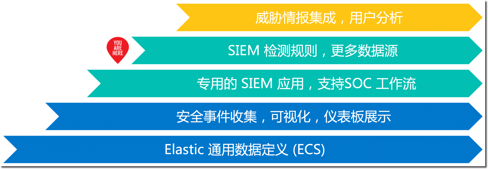

summary: Elastic 安全实战工作坊(中等)
id: elastic-security-foundation
categories: elasticsearch, beats, kibana, security
tags: elasticstack
status: Published 
authors: Martin Liu
Feedback Link: https://martinliu.cn
Analytics Account: UA-159133967-1

# Elastic 安全实战工作坊(中等)
<!-- ------------------------ -->
## 概述 
Duration: 10

在本课程中您将会学到：

1. 搭建单节点 Elasticsearch + Kibana 服务，完成准备工作。
2. 学习使用 Elastic Stack 做安全管理的基本概念和方案架构。
3. 搭建和配置服务健康检查的探针
4. 部署采集操作系统性能监控指标的流程
5. 配置操作系统日志的采集和分析工具
6. 搭建用于 APM 追踪分析的后台服务
7. 运行一个多层架构的宠物商店应用，对各个子服务进行 APM 监控埋点
8. 配置常用的服务质量监控大屏

### 演示应用

Elastic Stack 的基本状况：

* 版本 7.
* 组件 Elasticsearch、Kibana、Packetbeat、Filebeat、Metricbeat 和 Winlogbeat。
* 所有组件都部署在同一个虚拟机上。

### 安全管理旅程的四个阶段

可观测性依赖于应用系统自身和监控工具平台的配合实现。

分阶段的开展安全管理的推荐过程如下：

1. STEP0：使用 Beats 按需收集各种安全事件
2. STEP1：使用 SIEM 提供的功能开展 SOC 日常安全运维 
3. STEP2：基于内置的安全监测规则，进行自动化的安全分析
4. STEP3：与外部系统集成，集成更多数据源和系统

